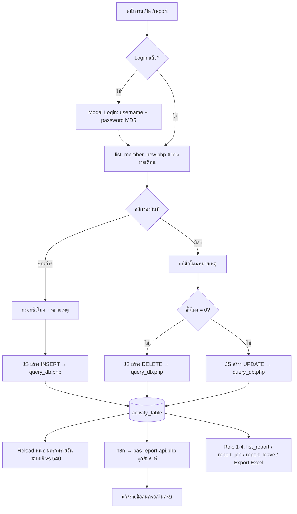

# 02 — Functional Specification (As-Is)

เอกสารนี้บันทึก **พฤติกรรมที่ยืนยันได้จาก Source code และข้อมูลจริง** เท่านั้น — ข้อเสนอสำหรับระบบใหม่อยู่ใน 03/05
Path อ้างอิงเทียบกับ `domains/pas-acc.com/public_html/report/`

## F1. Login และ Session [ยืนยันแล้ว]
- Login ผ่าน Modal ใน `nav_bar.php` (`?cp=false`) ด้วย Username + Password → เทียบ `md5(password)` กับ `member_table`
- สำเร็จ → เก็บ `uuid`, `MM_Username`, `MM_Name`, `MM_UserGroup` ใน PHP session → Redirect กลับหน้าเดิม (`PrevUrl`)
- ไม่ตรวจ `work = 1` ตอน Login → **พนักงานที่ลาออก (work=0) ยัง Login ได้หากรหัสผ่านยังอยู่**
- Checkbox "Remember me" ไม่มีผล
- เปลี่ยนรหัสผ่าน: กรอกรหัสใหม่ 2 ครั้ง (ไม่ถามรหัสเดิม, ไม่มี Password policy)
- Logout: `?doLogout=true` → `session_destroy()`
- ไม่มี Forgot password (Admin ตั้งรหัสให้ใน `list_manage.php`)

## F2. บันทึกเวลา (`list_member_new.php`) [ยืนยันแล้ว]

### หน้าจอ
- ตาราง **รายเดือน**: แถว = คู่ (ลูกค้า, ประเภทงาน) ที่ผู้ใช้เคยลงเวลาในเดือนนั้น, คอลัมน์ = วันที่ 1…สิ้นเดือน, คอลัมน์สุดท้าย = รวม
- เลือกเดือน/ปีผ่าน `?month=&year=` — **ไม่มีการจำกัดเดือนย้อนหลังหรือล่วงหน้า**
- แถวพิเศษ "ประชุมประจำเดือน" (Activity id 32, กลุ่ม Meet, ลูกค้ารหัส `90`) แสดงแยกทุกเดือน
- วันเสาร์-อาทิตย์, วันหยุดใน `holidays_table`, และ Activity กลุ่ม Leave แสดงสีแบบ "holiday" แต่ **ยังกรอกได้**
- ใต้ตารางแสดงรายการวันหยุดของเดือน (วันที่, ชั่วโมง, คำอธิบาย)
- แถวผลรวมรายวัน ระบายสีตามผลรวมนาที:
  - `> 540` → สีแดงอ่อน (เกิน)
  - `= 540` → สีเขียว (ครบ)
  - `< 540` → สีฟ้า (ยังไม่ครบ)

### การเพิ่มแถวใหม่
- ปุ่มเพิ่มแถว → เลือกลูกค้า (เฉพาะ `company_active != 0`) → โหลด Activity ที่เปิดให้ลูกค้านั้น (`activity_list_table.activity_active = 1`, ไม่รวม id 32) ผ่าน `j_query.php?x=`
- ต้องเลือกทั้งลูกค้าและงานก่อนคลิกช่องวันที่ มิฉะนั้นแจ้ง "กรุณาเลือก JOB และ Activity ก่อน!!"

### การบันทึก/แก้ไข/ลบ
| การกระทำ | Input | ผล |
|---|---|---|
| คลิกช่องว่าง | ชั่วโมง (`number`, step 0.5, min 0.5, max 9.0, ค่าเริ่มต้น 9.0) + หมายเหตุ | `INSERT activity_table` (นาที = ชั่วโมง × 60) |
| คลิกช่องที่มีค่า | ชั่วโมง (min 0.0, max 9.0) + หมายเหตุ (โหลดค่าเดิมผ่าน `j_query.php?up_period=`) | `UPDATE list_period, list_note` |
| ใส่ 0 ในช่องที่มีค่า | — | **`DELETE` ถาวร** |

- Validation ทั้งหมดอยู่ที่ Browser (HTML5) — Server ไม่ตรวจอะไร
- ไม่มีการตรวจรายการซ้ำ: การคลิกซ้ำหรือ Reload ระหว่างส่งทำให้เกิดแถวซ้ำ (พบ 765 กลุ่มในข้อมูล)
- ไม่มีการตรวจผลรวมรายวันเกิน 9 ชม. ตอนบันทึก (แสดงสีเตือนเท่านั้น)
- หน้าจอแสดงค่าเป็นผลรวมของทุกแถวในช่องเดียวกัน แต่การแก้ไขมีผลกับแถวใดแถวหนึ่งเท่านั้น (`job_id` ที่ MySQL เลือกจาก `GROUP BY`) — ถ้ามีแถวซ้ำ ผลรวมที่เห็นจะไม่ตรงกับค่าที่กรอก
- หน่วยเวลาเก็บเป็นนาที แสดงเป็น "ชั่วโมง.ครึ่ง" เช่น 90 นาที → `1.5`

## F3. กฎเวลาทำงาน
| กฎ | สถานะ | แหล่งอ้างอิง |
|---|---|---|
| 1 วันทำงาน = 540 นาที (9 ชม.) | [ยืนยันแล้ว] ใช้เป็นเกณฑ์สี, เกณฑ์แจ้งเตือน, ค่าเริ่มต้นวันหยุด, ตัวหารคำนวณต้นทุน | `list_member_new.php`, `line_notice.php`, `pas-report-api.php`, `holidays_table.hl_time` |
| สัปดาห์ทำงาน จันทร์–ศุกร์ = 5 × 540 − นาทีวันหยุด | [ยืนยันแล้ว] | `pas-report-api.php` |
| ต้องกรอกให้ครบทุกวันทำงาน (รวมวันลา) | [สังเกตจากข้อมูล] 99.1% ของวัน-คน รวม = 540 พอดี | สถิติ `activity_table` |
| หน่วยย่อยที่สุด 0.5 ชม. | [ยืนยันแล้ว — ฝั่ง Browser เท่านั้น] | `step="0.5"` |
| รายการเดียวไม่เกิน 9 ชม. | [ยืนยันแล้ว — ฝั่ง Browser เท่านั้น] | `max="9.0"` |
| 9 ชม. รวมหรือไม่รวมพักกลางวัน / OT | ❓ ไม่พบใน Code — ต้องยืนยันนโยบาย | — |

## F4. วันลา [ยืนยันแล้ว]
- ไม่มีระบบลาแยก — บันทึกเป็น Time entry ด้วย Activity กลุ่ม 4: ลากิจ (34), ลาป่วย (35), ลาพักร้อน (36)
- ไม่มีการขออนุมัติ, ไม่มียอดวันลาคงเหลือ
- `report_leave.php` แสดงรายการลาตามเดือน/ช่วงวันที่ (Role 1–4)

## F5. วันหยุด (`holiday.php`, `holiday_action.php`) [ยืนยันแล้ว]
- CRUD วันหยุด: วันที่ + คำอธิบาย; `hl_time` ใช้ค่า Default 540 (หน้าจอไม่ให้แก้ แม้ Schema รองรับครึ่งวัน)
- เมนูแสดงเฉพาะ Role 1–4 แต่ตัว Action ไม่ตรวจสิทธิ์ (ดู 00-H1)
- เพิ่มเมื่อ 19/8/2567 (ตาม `Read Me.txt`)

## F6. ข้อมูลหลัก (Master data) [ยืนยันแล้ว]
- **ลูกค้า** (`job_manage.php`): เพิ่ม/แก้ รหัส, ชื่อ, ที่อยู่, Tax ID, ผู้ดูแลลูกค้า (`company_admin`), สถานะ Active; เปลี่ยนรหัสลูกค้าได้ (Cascade update ด้วยมือ 3 คำสั่ง); ตรวจรหัส/ชื่อซ้ำ
- **Activity ต่อลูกค้า**: เปิด/ปิดประเภทงานที่ลงเวลาได้สำหรับลูกค้าแต่ละราย
- **พนักงาน** (`list_manage.php`): เพิ่ม/แก้ ชื่อ, ชื่อเล่น, Username, รหัสผ่าน, Role, ระดับ (ต้นทุน), ทีมย่อย, วันเริ่มงาน, สถานะทำงาน; ตรวจชื่อ/Username ซ้ำ
- ประเภทงาน (`job_table`) — ไม่พบหน้าจอจัดการ (แก้ใน DB โดยตรง)

## F7. รายงาน [ยืนยันแล้ว]
| รายงาน | เนื้อหา | สิทธิ์ |
|---|---|---|
| `list_report.php` | ตารางพนักงาน × วันของเดือน แสดงผลรวมรายวันพร้อมสีเดียวกับ F2; คลิกดูรายละเอียดรายวัน (`j_query.php?de=`) | 1–4 |
| `list_export.php` | Excel: พนักงาน × วัน ของ **เดือนปัจจุบันเท่านั้น**, หัวคอลัมน์เสาร์-อาทิตย์สีแดง | ไม่ตรวจ |
| `report_job.php` | สรุปตามลูกค้า: ชั่วโมงรวม, ต้นทุน, ผู้ดูแลลูกค้า, ชั่วโมงแยกตามระดับพนักงาน 6 ระดับ; เลือกเดือนหรือช่วงวันที่; Drill-down รายการ | 1–4 |
| `report_leave.php` | รายการลา | 1–4 |

⚠️ **สูตรต้นทุนไม่สอดคล้องกัน** [ยืนยันแล้ว]:
- สรุปรายลูกค้า (`report_job.php`): `SUM(lvl_rate × นาที / 60)` → ถือว่า `lvl_rate` เป็น **อัตรารายชั่วโมง**
- รายละเอียด (`j_query.php?com_`): `lvl_rate × นาที / 540` → ถือว่า `lvl_rate` เป็น **อัตรารายวัน**
- สองตัวเลขต่างกัน 9 เท่า — ต้องยืนยันว่าสูตรใดถูก (ดู 06-Q5)

## F8. การแจ้งเตือน [ยืนยันแล้ว]
- เดิม: `line_notice.php` / `line-noti/…friday15pm.php` ส่ง LINE Notify รายชื่อคนกรอกไม่ครบในสัปดาห์ (บริการ LINE Notify ปิดแล้ว)
  - มี Bug: `LEFT JOIN holidays × activity` ทำให้ผลรวมคูณกันเมื่อสัปดาห์มีวันหยุด
- ปัจจุบัน: n8n Cloud เรียก `pas-report-api.php` (token + read-only DB user) คืนรายชื่อคนกรอกไม่ครบ (พนักงาน `work=1`) และคนยังไม่รับทราบรายงานประชุมเดือนล่าสุด — ส่งต่อช่องทางใดใน n8n ไม่ทราบ (ต้องดูใน n8n)
- ไม่มี Email / In-app notification

## F9. รายงานการประชุมประจำเดือน [ยืนยันแล้ว]
- Admin สร้างรายงานประชุม (หัวข้อ, วันที่, เวลาเริ่ม-จบ, เนื้อหา CKEditor)
- พนักงานอ่าน (`meet_list.php`, `meet_detail.php`) และกด "บันทึก" เพื่อรับทราบ → `meet_agree`
- `report_list.php` แสดงผู้ที่รับทราบ/ยังไม่รับทราบ (เฉพาะพนักงานที่เริ่มงานก่อนวันประชุม)

## F10. สิ่งที่ **ไม่มี** ในระบบเดิม [ยืนยันแล้ว]
- Submission / Approval / Rejection ของ Time Report
- การปิดงวด (Period lock) — แก้ไขข้อมูลเดือนใดก็ได้ตลอดเวลา
- การจำกัดการบันทึกย้อนหลัง
- เวลาเริ่ม-เวลาสิ้นสุด (บันทึกเป็นระยะเวลาเท่านั้น)
- Project/Engagement แยกจากลูกค้า (ใช้ Customer × Activity)
- Audit trail, Export PDF, SSO/MFA, API สำหรับระบบอื่น (ยกเว้น n8n read-only)

## Workflow (As-Is)

ไม่มีขั้นตอน Submit หรือ Approve — ข้อมูลที่บันทึกถือเป็นข้อมูลจริงทันทีและแก้ไขได้ตลอด
