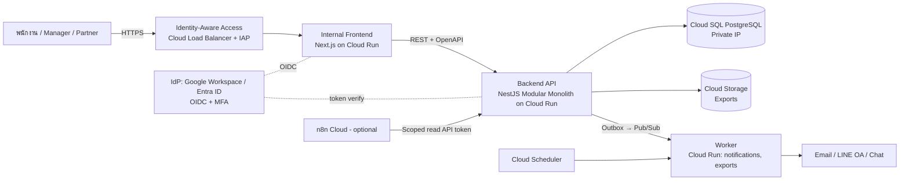

# 05 — Proposed Architecture [ข้อเสนอ]

## 1. Reuse / Refactor / Rewrite

| ทางเลือก | ประเมิน |
|---|---|
| Reuse (ใช้ PHP เดิม) | ❌ Write path ทั้งหมดเป็น Raw SQL จาก Browser, ไม่มี Layer ให้เพิ่ม AuthZ/Audit/Workflow |
| Refactor | ❌ ~8,500 บรรทัด ไม่มี Test, Logic ผสม HTML/JS/SQL — ต้นทุนใกล้เคียงเขียนใหม่ แต่ยังติดข้อจำกัด Shared hosting |
| **Rewrite** | ✅ Business logic ของ Time Report มีขนาดเล็กและระบุได้ครบแล้ว (02) → เขียนใหม่ตาม Baseline stack; เก็บเฉพาะ **พฤติกรรม** และ **ข้อมูล** |

Baseline stack ใน Master Prompt เหมาะสม ไม่มี Infrastructure เดิมที่ต้อง Reuse (Shared hosting ไม่มีสิ่งที่ต้องคงไว้)
ข้อเลือกเฉพาะ: **Prisma** (Migration + Type safety, เอกสารมาก เหมาะกับการส่งต่อทีม) · **pnpm + Turborepo monorepo**

## 2. System Context



- **Internal by default**: ทั้ง Frontend และ API อยู่หลัง IAP/OIDC; ไม่มี Route สาธารณะใน Phase 1
- Public Portal ในอนาคตเป็น Service และ Auth policy แยก (Load balancer path/host แยก, API prefix `/public/v1` แยก Guard)

## 3. Component / Module Structure

```
pas-platform/
├─ apps/
│  ├─ web/                 Next.js (App Router), Tailwind, TanStack Query
│  ├─ api/                 NestJS — HTTP API + OpenAPI
│  └─ worker/              NestJS standalone — Pub/Sub consumers, scheduled jobs
├─ packages/
│  ├─ db/                  Prisma schema + migrations + seed
│  ├─ contracts/           OpenAPI-generated types / zod schemas ร่วมกัน
│  ├─ ui/                  Design system (Table, Form, States, Layout)
│  └─ config/              eslint, tsconfig
├─ infra/terraform/        GCP (Cloud Run, Cloud SQL, IAP, Pub/Sub, Secret Manager)
├─ tools/legacy-migration/ MySQL dump → PostgreSQL + reconciliation
└─ docs/
```

Modules ใน `apps/api/src/modules/` — **สร้างเฉพาะที่มี Logic จริงใน Phase 1**:

| Module | Phase 1 | หน้าที่ |
|---|:-:|---|
| `identity` | ✅ | OIDC verify, session, user ↔ employee |
| `authorization` (shared) | ✅ | Policy engine RBAC + ABAC (CASL หรือ policy functions) — ทุก Handler ต้องผ่าน |
| `organization` / `employee` | ✅ | พนักงาน, ทีม, ระดับ, สถานะ |
| `customer` | ✅ | ลูกค้า + Engagement (customer × work category) |
| `time-report` | ✅ | Time entry, daily/weekly completeness, period lock |
| `work-calendar` | ✅ | วันหยุด, ชั่วโมงเป้าหมาย |
| `reporting` | ✅ | รายงาน + Excel export (async ผ่าน worker) |
| `notification` | ✅ | Notification Center + ช่องทางภายนอก |
| `announcement` | ✅ | ประกาศ + รับทราบ (ย้ายจาก meet) |
| `audit` | ✅ | Append-only audit log |
| `workflow` / `approval` | ⏸ | สร้างเมื่อยืนยัน 06-Q1 — ออกแบบ Time entry ให้มี `status` + `period` รองรับไว้แล้ว |
| `document`, `procurement`, `it-asset`, ... | ❌ | อนาคต — Launcher แสดงเป็น Planned |

กฎ Modular Monolith: Module อื่นเรียกกันผ่าน Public service interface หรือ Domain event เท่านั้น; ห้าม Query ตารางของ Module อื่นตรง

## 4. Core Domain Model (ร่าง ERD)

```mermaid
erDiagram
    EMPLOYEE ||--o| USER_ACCOUNT : has
    EMPLOYEE }o--|| ORG_UNIT : belongs
    EMPLOYEE ||--o{ EMPLOYEE_LEVEL_HISTORY : has
    EMPLOYEE_LEVEL ||--o{ COST_RATE : "rate by effective date"
    CUSTOMER ||--o{ ENGAGEMENT : has
    WORK_CATEGORY ||--o{ ENGAGEMENT : "offered as"
    EMPLOYEE ||--o{ CUSTOMER : "account owner"
    EMPLOYEE ||--o{ TIME_ENTRY : records
    ENGAGEMENT ||--o{ TIME_ENTRY : "charged to"
    REPORTING_PERIOD ||--o{ TIME_ENTRY : contains
    TIME_ENTRY ||--o{ AUDIT_EVENT : "history"
    ANNOUNCEMENT ||--o{ ANNOUNCEMENT_ACK : acknowledged
    NOTIFICATION }o--|| EMPLOYEE : to
```

`time_entry` (หลัก):
- `id uuid`, `employee_id`, `engagement_id`, `work_date date`, `duration_minutes int CHECK (>0 AND <= policy_max)`, `description`, `status` (`DRAFT|SUBMITTED|APPROVED|REJECTED|MIGRATED` — ใช้เฉพาะ DRAFT/MIGRATED จนกว่าจะยืนยัน Approval), `version int` (optimistic locking), `created_*`, `updated_*`, `deleted_at`, `legacy_id`
- `UNIQUE (employee_id, engagement_id, work_date) WHERE deleted_at IS NULL`
- Validation ที่ Backend: หน่วยเวลา (config), ห้ามเขียนในงวดที่ปิด, สิทธิ์บันทึกย้อนหลัง, Engagement ต้อง Active ณ วันที่ทำงาน

## 5. API (ตัวอย่าง — OpenAPI จะจัดทำใน Milestone 2)

```
GET    /api/v1/me                               โปรไฟล์ + สิทธิ์ + Apps ที่ใช้ได้
GET    /api/v1/time-entries?month=2026-09       ตารางรายเดือนของตนเอง
PUT    /api/v1/time-entries/{date}/{engagementId}   upsert (idempotent) + If-Match: version
DELETE /api/v1/time-entries/{id}
GET    /api/v1/time-entries/summary?week=...    ความครบถ้วนรายวัน/สัปดาห์
GET    /api/v1/engagements?customerId=&active=true
GET    /api/v1/reports/timesheet?month=&orgUnit=
GET    /api/v1/reports/customer-effort?from=&to=
POST   /api/v1/exports  → 202 + job id (สร้างไฟล์ใน Worker, ลิงก์ Signed URL อายุสั้น)
GET    /api/v1/notifications / POST .../{id}/read
```

## 6. Security Design
- **AuthN**: OIDC (Authorization Code + PKCE) กับ IdP ขององค์กร, MFA บังคับที่ IdP; IAP ชั้นนอก; Session cookie `HttpOnly; Secure; SameSite=Lax` + CSRF token สำหรับ mutation
- **AuthZ**: ตรวจที่ Backend ทุก Request — RBAC (role) + ABAC (org unit, account owner, ตนเอง) + Resource-level (เป็นเจ้าของ entry, อยู่ในทีม)
  - ตัวอย่าง: Manager เห็น Time entry ของ `org_unit` ที่ตนดูแล; อัตราต้นทุนเห็นเฉพาะ Permission `cost.read`
- **Data**: Cloud SQL Private IP, CMEK/Default encryption at rest, TLS, Secret Manager, Least-privilege service accounts ต่อ Service
- **App**: Validation ด้วย zod/class-validator ที่ Backend, Parameterized queries (Prisma), Rate limit, Helmet security headers, CSP
- **Audit**: Login, Time entry create/update/delete (before/after), Export (ใคร/อะไร/เมื่อใด/ขอบเขต), Permission change, Master data change — Append-only table + ส่งต่อ Cloud Logging; ห้าม Log token/password
- **n8n**: ถ้ายังใช้ ให้ใช้ Service account token ที่ Scope เฉพาะ read endpoint + Audit

## 7. Event-driven (เฉพาะงาน Async)
- **Transactional Outbox** ใน PostgreSQL → Relay ส่ง Pub/Sub → Worker (Idempotent ด้วย event id, Retry + Exponential backoff, Dead Letter Topic)
- Events Phase 1: `TimeEntryChanged`, `WeeklyCompletenessComputed`, `ExportRequested/Completed`, `NotificationFailed`, `AnnouncementPublished`
- Time Report **ไม่พึ่ง** Worker/Email/AI: ถ้า Pub/Sub หรือ Email ล่ม การบันทึกเวลายังทำงานปกติ

## 8. HA / DR — ข้อสังเกตเรื่องเป้าหมายและค่าใช้จ่าย
Target ใน Master Prompt: 99.99%, RTO ≤ 5 นาที, RPO ≤ 1 นาที

| องค์ประกอบ | ทำได้อย่างไร | หมายเหตุ |
|---|---|---|
| Stateless app | Cloud Run min instances ≥ 2 ต่อ Service, หลาย Zone อัตโนมัติ | |
| Database | Cloud SQL **Regional HA** (failover อัตโนมัติ ~1 นาที) + PITR + Automated backups | ค่า DB ~2 เท่าของ Single-zone |
| RPO 1 นาที | HA synchronous replication (ภายใน Region) + PITR | Cross-region ต้อง Read replica เพิ่ม |
| 99.99% | SLA ของ Cloud SQL HA คือ 99.99% (Enterprise Plus) / 99.95% (Enterprise) | Enterprise Plus แพงขึ้นอย่างมีนัยสำคัญ |

ข้อเสนอ: เริ่มที่ **Cloud SQL Enterprise + Regional HA** (เป้าหมายจริง ~99.95%) สำหรับผู้ใช้ ~40 คน และตั้ง SLO ตามที่วัดได้จริง ก่อนตัดสินใจเพิ่มเป็น Enterprise Plus / Cross-region DR (06-Q10)

## 9. Observability
- OpenTelemetry SDK ใน API/Worker/Web → Cloud Trace + Cloud Logging (JSON: `requestId`, `traceId`, `service`, `route`, `status`, `latencyMs`, `userId` แบบ Hash)
- Business metrics: entries/day, completeness rate รายสัปดาห์, export count, notification failure
- Alerts: 5xx rate, p95 latency, DB CPU/connections, DLQ depth, failed logins spike
- AI Ops: ให้ Agent อ่าน Logs/Traces/Metrics แบบ Read-only role เท่านั้น ไม่มีสิทธิ์ IAM/DB write

## 10. CI/CD
`PR → lint → typecheck → unit → integration (Testcontainers PostgreSQL) → SAST (CodeQL) + dependency scan + secret scan → build image → deploy Staging (Terraform plan/apply) → E2E (Playwright) → UAT → manual approval → Production`
Prisma migrations รันเป็น Job แยกก่อน Deploy; ห้ามแก้ Production DB ด้วยมือ

## 11. Roadmap (ต่อจาก Milestone 1)
| Milestone | ส่งมอบ | ขึ้นกับ |
|---|---|---|
| 0 (แนะนำเพิ่ม) | Containment ระบบเดิม (00) | อนุมัติจากเจ้าของระบบ |
| 2 | Wireframes Homepage/Time Report, OpenAPI, ERD ละเอียด, Security design | คำตอบ 06 |
| 3 | Monorepo, OIDC, AuthZ, DB, Audit, CI/CD, Dev env | IdP (06-Q7), GCP project |
| 4 | Homepage: Dashboard, Launcher, Notification Center, Announcements | 3 |
| 5 | Time Report: Entry grid, Calendar, Reports, Export, (Approval ถ้ายืนยัน) | 3, 06-Q1..Q5 |
| 6 | Tests, Migration dry-runs, UAT, Cutover, Backup/Restore drill | 4, 5 |
