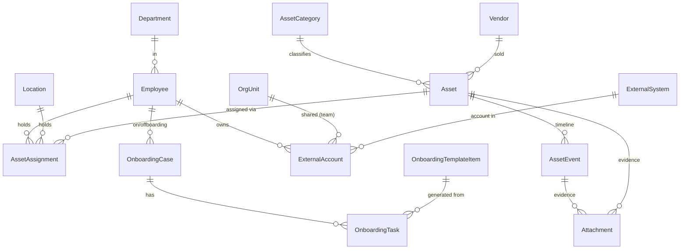
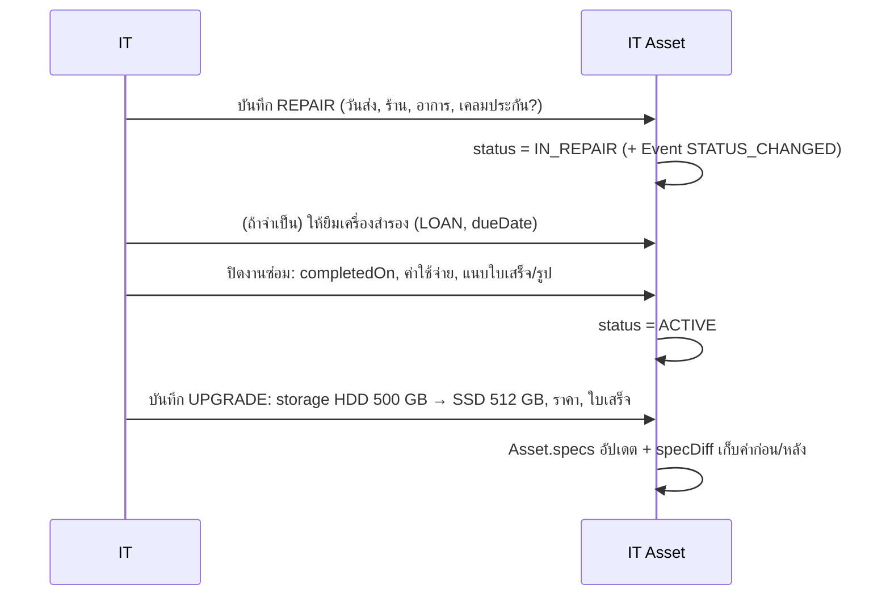

# 07 — IT Asset & Employee Onboarding (Design)

สถานะ: **ร่างออกแบบ (2026-09-28)** — ยังไม่ Implement รอคำตอบ [คำถามท้ายเอกสาร](#10-คำถามที่ต้องตัดสินใจ) (รวมไว้ใน 06 ด้วย)

## 0. เป้าหมาย

1. **รับพนักงานใหม่**: HR/IT เพิ่มพนักงานครั้งเดียวในระบบ → พนักงานเข้าระบบ PAS ได้ (Time Report, รายงานการประชุม, ประกาศ, …) พร้อม Checklist งานที่ต้องเปิดให้ (Email, Xerox, TRC, เครื่อง ฯลฯ)
2. **IT Asset**: ทะเบียนอุปกรณ์ทุกชิ้น มีรหัสประจำเครื่อง รู้ว่า**ตอนนี้ใครถือ** และดู**ประวัติทั้งชีวิตของเครื่อง** (มอบให้ใคร, ซ่อมเมื่อไร, เปลี่ยนอะไร, ค่าใช้จ่าย) พร้อม**ไฟล์หลักฐาน**
3. `Employee` เป็นศูนย์กลาง — ทุกอย่าง (สิทธิ์, บัญชีระบบอื่น, เครื่อง) ผูกกับพนักงานคนเดียวกัน

ไม่อยู่ในขอบเขตรอบนี้: ระบบเบิกวัสดุสิ้นเปลือง (`theinventory`) — ยังเป็นลิงก์ภายนอกใน Launcher (ดู §9 Phase 3)

## 1. แหล่งข้อมูลเดิมที่สำรวจ

| แหล่ง | ลักษณะ | หมายเหตุ |
|---|---|---|
| Google Sheet "สำรวจความเพียงพอของอุปกรณ์" | แท็บละเดือน (02.69–09.69) 57 เครื่อง × 22 คอลัมน์ + ESET, จอเสริม, แผนอัปเกรด, ขอซื้อ NB | [ยืนยันแล้ว] |
| `พนักงานใหม่_V02032569.xlsx` | Checklist รับพนักงาน/นศ.ฝึกงาน, Xerox, โครงทีม, รายชื่อ Mailbox รายเดือน, Map Drive | **มีรหัสผ่านจริง** — ไม่นำเข้า ไม่คัดลอก |
| `theinventory` (PHP + `pasacccom_theinventory`) | ระบบเบิกวัสดุ 53 รายการ, 1,543 ใบเบิก (2020–2026-09) | ไม่ใช่ทะเบียน IT; user แยก 81 คน รหัส MD5 |
| DNS `pas-acc.com` | MX → `mail.pas-acc.com` (DirectAdmin) | [ยืนยันแล้ว] ไม่มี Google Workspace / M365 → กระทบ §5 |

### 1.1 Mapping พฤติกรรมเดิม → ระบบใหม่

**Sheet อุปกรณ์**

| เดิม | ใหม่ |
|---|---|
| แท็บละเดือน (คัดลอกทั้งตาราง) | ข้อมูลปัจจุบัน 1 ชุด + ประวัติเป็น Event; "รอบสำรวจ" เป็น `InspectionRound` (Phase 2) |
| ลำดับ (สลับทุกเดือน) | ไม่ใช้ — ใช้ `Asset.code` |
| รหัสสินทรัพย์ (NB-0011, PC-0009, CEO-0001, OE348, NB-0017-1) | `Asset.code` คงรหัสเดิม; รหัสใหม่ออกอัตโนมัติตาม Prefix |
| "รหัสใน FA NB-0019" (ในช่องชื่อ) | `Asset.faCode` แยกช่อง |
| ชื่อผู้ใช้ / ชื่อเล่น (ปนสถานที่ สถานะ หมายเหตุ) | `AssetAssignment` → พนักงาน **หรือ** สถานที่ **หรือ** ว่าง(สำรอง) |
| สถานะผู้ใช้งาน (ผู้ใช้ขอเปลี่ยน/อัปเกรด) | Event `ISSUE` / คำขอ (Phase 2) |
| สถานะเครื่อง (ปกติ / สแป / ไม่พร้อมใช้งาน / อัพเกรดเพื่อใช้ต่อ) | `Asset.status` + ผู้ถือ (ว่าง = สำรอง) |
| ประสิทธิภาพ (ปกติ/ช้า), หมายเหตุจาก IT | `InspectionResult` (Phase 2) / Event `NOTE` |
| ยี่ห้อ, CPU, RAM, HDD/SSD, Windows, ชื่อรุ่น | `Asset.brand/model/serialNo` + `Asset.specs` (JSON ตามประเภท) |
| Email (Sync 1 Day) | `specs.mailSync` |
| ราคาทุน, อายุ 5 ปี, วันหมดอายุ, ผู้จัดจำหน่าย | `cost`, `usefulLifeYears`, (คำนวณ), `vendorId` |
| อายุ(ปี) = `DATEDIF(TODAY)` | คำนวณตอนแสดงผล |
| List-ESET (ผูกด้วย hostname) | `SoftwareLicense` + `LicenseSeat` ผูกกับ Asset; `Asset.hostname` (Phase 2) |
| จอเสริม MO-1..10 (ผูกด้วยชื่อเล่น) | Asset ประเภท `MONITOR` + Assignment |
| อัพเกรด 2026 (ชิ้นส่วน, ราคา, ลิงก์) | คำขออัปเกรด (Phase 2) → เมื่อทำเสร็จเป็น Event `UPGRADE` |
| ขอซื้อ NB ใหม่ (เหตุผล) | คำขอซื้อ (Phase 2) |
| Note (แผนย้ายเครื่อง, "ยืมช่วงส่งซ่อม") | Assignment ชนิด `LOAN` มีวันคืน + Event `NOTE` |

**Workbook พนักงานใหม่**

| เดิม | ใหม่ |
|---|---|
| รหัส พนง. (ตัวเลข/ข้อความปนกัน), นศ. ใช้ 1xxx | `Employee.employeeCode` (ข้อความ, คงเลข 0 นำหน้า) |
| เริ่มงาน / ช่วงฝึกงาน (พ.ศ./ค.ศ. ปน) | `startDate`, `endDate` (ค.ศ. ในฐานข้อมูล แสดงผล พ.ศ.) |
| ชื่อ TH / EN / ชื่อเล่น / Email ส่วนตัว | `fullName`, `fullNameEn`, `nickname`, `personalEmail` |
| แผนก / ตำแหน่ง (Junior…Manager) / ทีม | `Department` (ใหม่) / `EmployeeLevel` (มีแล้ว) / `OrgUnit` (มีแล้ว) |
| แท็บ นศ.ฝึกงาน + สถาบัน | `employmentType = INTERN`, `institution` |
| User ถ่ายเอกสาร, โฟลเดอร์สแกน, User Time Report, Email PAS, TRC User | `ExternalAccount` (ระบบ + ชื่อบัญชี + สถานะ) — **ไม่มีช่องรหัสผ่าน** |
| password | **ไม่ย้าย** (§5) |
| NB/PC | `AssetAssignment` |
| ติ๊ก P: Xerox, Outlook, เครื่องปริ้น, ส่งลิงก์ฟอร์ม | `OnboardingTask` จาก Template |
| "หลัง 3 สัปดาห์ส่ง Email, TRC, Scan" | Template item `dueOffsetDays = 21` |
| Stuckture (ทีม → ทีมย่อย → สมาชิก) | `OrgUnit` tree (มีแล้ว) |
| เมล Pas รายเดือน (คัดลอกทุกเดือน) | รายงาน `ExternalAccount` ระบบ Email (ปัจจุบัน + ประวัติเปิด/ปิด) |
| เครื่องXerox (User ID + เช็คครบ/ยังรายเดือน) | `ExternalAccount` ระบบ Xerox; ความหมาย "ครบ/ยัง" → Q-IT7 |
| User Mapdrive (บัญชีร่วมรายทีม) | `ExternalAccount` ผูก `OrgUnit` ได้ (ไม่ใช่รายคน) → Q-IT6 |
| PC&NB Map (ผังที่นั่ง, จอ/เมาส์/คีย์บอร์ด, "พร้อมนำไปติดตั้ง") | Assignment + Task "ติดตั้งเครื่อง" |
| (ไม่มี) ขั้นตอนพนักงานลาออก | **ใหม่**: Offboarding case สร้างงานจากบัญชี/เครื่องที่ถืออยู่ |

## 2. หลักการออกแบบ

- **Employee = ศูนย์กลาง** ไม่มีตาราง "user" แยกต่อระบบในแพลตฟอร์ม
- **ไม่เก็บรหัสผ่านของระบบอื่น** เก็บแค่ "มีบัญชีอะไร ชื่ออะไร สถานะอะไร" — รหัสผ่านอยู่ใน Password manager / ให้ผู้ใช้ตั้งเอง
- **ประวัติไม่หาย**: ผู้ถือเครื่องเป็นแบบ effective-dated (แนวเดียวกับ `ScheduleAssignment`), ทุกการเปลี่ยนแปลงของเครื่องเป็น `AssetEvent` + `AuditEvent`
- **Timeline เดียว**: การมอบ/คืน/เปลี่ยนสถานะ ระบบสร้าง Event ให้อัตโนมัติ จึงดูประวัติทั้งหมดได้จากที่เดียว
- **ค่ากำหนดเป็นข้อมูล**: ประเภทอุปกรณ์, Prefix รหัส, ช่องสเปก, รายการ Checklist, รายชื่อระบบภายนอก แก้ได้จากหน้า Admin
- **ไม่ลบ** Event/ไฟล์หลักฐาน — ใช้ "ยกเลิก (void) พร้อมเหตุผล"

## 3. Data model



### 3.1 Employee (เพิ่มฟิลด์)

```prisma
enum EmploymentType { EMPLOYEE INTERN DIRECTOR CONTRACTOR }

model Employee {
  // … ฟิลด์เดิม (fullName, nickname, email, status, startDate, orgUnit, level, roles) …
  employeeCode   String?        @unique @map("employee_code")   // "0262", "1046"
  fullNameEn     String?        @map("full_name_en")
  personalEmail  String?        @map("personal_email")          // PII: เห็นเฉพาะ employee.admin
  employmentType EmploymentType @default(EMPLOYEE) @map("employment_type")
  endDate        DateTime?      @map("end_date") @db.Date       // วันสิ้นสุด (ลาออก/จบฝึกงาน)
  institution    String?                                         // นศ.ฝึกงาน
  departmentId   String?        @map("department_id") @db.Uuid  // บัญชี/ธุรการ/ทะเบียน/Audit/IT/HR
}

model Department { id String @id @db.Uuid; name String @unique; sortOrder Int; isActive Boolean }
```

### 3.2 IT Asset

```prisma
enum AssetStatus {
  ACTIVE      // ใช้งานได้ (มีผู้ถือ = ใช้อยู่, ไม่มี = สำรอง/สแป)
  IN_REPAIR   // ส่งซ่อม
  BROKEN      // ไม่พร้อมใช้งาน/เสีย รอตัดสินใจ
  RETIRED     // ไม่เหมาะกับการใช้งานแล้ว เก็บไว้
  DISPOSED    // จำหน่าย/ทิ้ง/ขาย (สิ้นสุด)
  LOST
}

model AssetCategory {            // NB, PC, SERVER, MONITOR, PRINTER, NETWORK, PERIPHERAL …
  id         String  @id @db.Uuid
  key        String  @unique
  name       String
  codePrefix String                         // "NB" → NB-0049
  specFields Json                           // [{key:"cpu",label:"CPU"},{key:"ram",…},{key:"storage",…},{key:"os",…}]
  trackIndividually Boolean @default(true)  // เมาส์/คีย์บอร์ด → Q-IT8
  isActive   Boolean @default(true)
}

model Asset {
  id              String      @id @db.Uuid
  code            String      @unique        // รหัสประจำเครื่อง ไม่นำกลับมาใช้ซ้ำ
  categoryId      String      @db.Uuid
  status          AssetStatus @default(ACTIVE)
  brand           String?
  model           String?
  serialNo        String?     @unique
  hostname        String?                     // ใช้จับคู่ ESET/Windows
  faCode          String?                     // รหัสทะเบียนสินทรัพย์ถาวร (บัญชี)
  specs           Json                        // ค่าปัจจุบัน; เปลี่ยนได้ผ่าน Event เท่านั้น
  purchaseDate    DateTime?   @db.Date        // วันเริ่มใช้งาน
  cost            Decimal?    @db.Decimal(12,2)
  usefulLifeYears Int         @default(5)
  warrantyUntil   DateTime?   @db.Date
  vendorId        String?     @db.Uuid
  notes           String?
  version         Int         @default(1)     // optimistic locking
  createdAt / updatedAt
}

model Location { id String @id @db.Uuid; name String @unique; isActive Boolean }  // ห้อง Server, โต๊ะ Shell, ห้องพิมพ์ชั้น 2
model Vendor   { id String @id @db.Uuid; name String @unique; phone String?; note String? }

enum AssignmentKind { PRIMARY LOAN SHARED }

/// ใครถือเครื่องช่วงไหน — ช่วง [startDate, endDate) ต่อเครื่องห้ามซ้อนกัน (exclusion constraint)
model AssetAssignment {
  id          String         @id @db.Uuid
  assetId     String         @db.Uuid
  employeeId  String?        @db.Uuid     // ต้องมีอย่างใดอย่างหนึ่ง: employeeId XOR locationId (CHECK)
  locationId  String?        @db.Uuid
  kind        AssignmentKind
  startDate   DateTime       @db.Date
  endDate     DateTime?      @db.Date     // null = ยังถืออยู่
  dueDate     DateTime?      @db.Date     // LOAN: กำหนดคืน
  approximate Boolean        @default(false) // นำเข้าจาก Sheet รายเดือน (รู้แค่ระดับเดือน)
  note        String?
  createdById String         @db.Uuid
}
```

### 3.3 ประวัติเครื่อง + หลักฐาน

```prisma
enum AssetEventType {
  REGISTERED      // ลงทะเบียน
  ASSIGNED        // มอบ/ย้ายผู้ถือ (ระบบสร้าง)
  RETURNED        // คืนเครื่อง (ระบบสร้าง)
  STATUS_CHANGED  // (ระบบสร้าง)
  ISSUE           // แจ้งปัญหา
  REPAIR          // ซ่อม (ส่งร้าน/ซ่อมเอง)
  UPGRADE         // เปลี่ยน/เพิ่มชิ้นส่วน เช่น HDD → SSD, RAM 4 → 8 GB
  SOFTWARE        // ติดตั้ง/ลง Windows ใหม่/ไลเซนส์
  INSPECTION      // ตรวจตามรอบ MA
  SPEC_CORRECTED  // แก้สเปกที่บันทึกผิด (ไม่ใช่การเปลี่ยนจริง)
  NOTE
  DISPOSED
}

model AssetEvent {
  id           String         @id @db.Uuid
  assetId      String         @db.Uuid
  type         AssetEventType
  occurredOn   DateTime       @db.Date     // วันที่เกิดจริง (ลงย้อนหลังได้)
  completedOn  DateTime?      @db.Date     // REPAIR: วันรับเครื่องคืน
  title        String                      // "เปลี่ยน HDD เป็น SSD 512GB"
  detail       String?
  specDiff     Json?                       // {"storage": ["HDD 500 GB", "SSD 512 GB"]}
  cost         Decimal?       @db.Decimal(12,2)
  vendorId     String?        @db.Uuid
  underWarranty Boolean?                   // เคลมประกันหรือไม่
  employeeId   String?        @db.Uuid     // ผู้เกี่ยวข้อง (ผู้แจ้ง/ผู้รับเครื่อง)
  recordedById String         @db.Uuid
  recordedAt   DateTime       @default(now())
  voidedAt     DateTime?                   // ยกเลิกแทนการลบ
  voidReason   String?
}

enum AttachmentKind { RECEIPT QUOTATION PHOTO DELIVERY_NOTE WARRANTY REPORT OTHER }

model Attachment {
  id           String         @id @db.Uuid
  assetId      String         @db.Uuid
  assetEventId String?        @db.Uuid     // แนบกับเหตุการณ์ หรือกับเครื่องโดยตรง (เช่น ใบรับประกัน)
  kind         AttachmentKind
  fileName     String
  mimeType     String                      // อนุญาต: jpg, png, webp, heic, pdf
  sizeBytes    Int                         // สูงสุด 20 MB (ค่ากำหนด)
  sha256       String
  storageKey   String                      // Object storage (GCS ตาม docs/05); dev = โฟลเดอร์ local
  uploadedById String         @db.Uuid
  uploadedAt   DateTime       @default(now())
  voidedAt     DateTime?
}
```

### 3.4 Onboarding / บัญชีระบบอื่น

```prisma
model ExternalSystem {           // Email PAS, TRCloud, Xerox, โฟลเดอร์สแกน, Map Drive, ESET, AppSheet …
  id              String  @id @db.Uuid
  key             String  @unique
  name            String
  identifierLabel String           // "อีเมล", "User ID", "ชื่อโฟลเดอร์"
  identifierUnique Boolean @default(true)  // เช่น Xerox User ID ห้ามซ้ำ
  isActive        Boolean @default(true)
}

enum ExternalAccountStatus { PENDING ACTIVE DISABLED }

model ExternalAccount {
  id          String  @id @db.Uuid
  systemId    String  @db.Uuid
  employeeId  String? @db.Uuid     // รายคน
  orgUnitId   String? @db.Uuid     // บัญชีร่วมของทีม (Map Drive) — employeeId XOR orgUnitId
  identifier  String               // anuraks@pas-acc.com / 9262 / scan-folder-name
  status      ExternalAccountStatus
  activatedOn DateTime? @db.Date
  disabledOn  DateTime? @db.Date
  note        String?              // ห้ามใส่รหัสผ่าน (validation ตรวจรูปแบบที่ดูเหมือนรหัส + ข้อความเตือน)
  // unique (systemId, identifier) WHERE status <> 'DISABLED' AND system.identifierUnique
}

enum CaseKind { ONBOARDING OFFBOARDING }
enum TaskStatus { TODO DONE SKIPPED NOT_APPLICABLE }

model OnboardingTemplateItem {
  id              String   @id @db.Uuid
  kind            CaseKind
  key             String   @unique
  title           String                       // "ตั้งค่า User พิมพ์ Xerox"
  systemId        String?  @db.Uuid            // ถ้างานนี้คือการเปิดบัญชี → ทำเสร็จต้องกรอก ExternalAccount
  requiresAsset   Boolean  @default(false)     // งาน "มอบเครื่อง NB/PC"
  dueOffsetDays   Int      @default(0)         // 0 = วันแรก, 21 = หลัง 3 สัปดาห์
  appliesTo       EmploymentType[]             // นศ.ฝึกงานไม่ต้องมี TRC ฯลฯ
  ownerPermission String   @default("onboarding.manage")
  sortOrder       Int
  isActive        Boolean  @default(true)
}

model OnboardingCase {
  id         String   @id @db.Uuid
  employeeId String   @db.Uuid
  kind       CaseKind
  openedOn   DateTime @db.Date
  closedOn   DateTime? @db.Date
  openedById String   @db.Uuid
}

model OnboardingTask {
  id                String     @id @db.Uuid
  caseId            String     @db.Uuid
  templateItemId    String?    @db.Uuid
  title             String                    // snapshot จาก Template
  dueDate           DateTime   @db.Date
  status            TaskStatus @default(TODO)
  externalAccountId String?    @db.Uuid      // ผลลัพธ์ของงานเปิด/ปิดบัญชี
  assignmentId      String?    @db.Uuid      // ผลลัพธ์ของงานมอบ/คืนเครื่อง
  doneById          String?    @db.Uuid
  doneAt            DateTime?
  note              String?
}
```

**Template เริ่มต้น** (จากคอลัมน์ในไฟล์เดิม — แก้ได้)

| วัน | งาน | ระบบ |
|---|---|---|
| 0 | สร้างบัญชีเข้าระบบ PAS (Time Report, ประชุม, ประกาศ) | อัตโนมัติเมื่อบันทึกพนักงาน (§5) |
| 0 | มอบเครื่อง NB/PC + จอ/เมาส์/คีย์บอร์ด และติดตั้ง | IT Asset |
| 0 | User ถ่ายเอกสาร + ตั้งชื่อ User พิมพ์ Xerox + เพิ่มเครื่องปริ้น | Xerox |
| 0 | แนะนำลิงก์ฟอร์ม (ใบพบลูกค้า, รับ-ส่งเอกสาร, IT Requests, Document Store, เบิกอุปกรณ์) | ปิดได้ทันที — อยู่ใน Launcher แล้ว |
| 21 | Email PAS + ตั้งค่า Outlook | Email |
| 21 | โฟลเดอร์สแกน | Scan |
| 21 | TRCloud User | TRC |
| 0 | ติดตั้ง ESET | (Phase 2: License seat) |

## 4. Workflows

### 4.1 เพิ่มพนักงานใหม่ (Wizard 4 ขั้น)

```mermaid
flowchart LR
  A[1. ข้อมูลพื้นฐาน<br/>รหัส, ชื่อ TH/EN, ชื่อเล่น,<br/>ประเภท, วันเริ่ม/สิ้นสุด, อีเมล] --> B[2. สังกัดและสิทธิ์<br/>แผนก, ทีม, ระดับ,<br/>บทบาท: ค่าเริ่มต้น Employee]
  B --> C[3. อุปกรณ์ (ไม่บังคับ)<br/>เลือกจากเครื่องสำรอง]
  C --> D[4. ตรวจสอบ → บันทึก]
  D --> E[Employee ACTIVE<br/>+ บัญชีเข้าระบบ + เชิญทางอีเมล]
  D --> F[OnboardingCase + Tasks<br/>ตาม Template/ประเภท]
  D --> G[AssetAssignment + Event ASSIGNED]
```

- บันทึกทั้งหมดใน Transaction เดียว + AuditEvent
- ถ้าวันเริ่มงานเป็นอนาคต: สถานะ `ACTIVE` แต่ login ได้ตั้งแต่วันเริ่มงาน (ตรวจที่ Session guard)
- บทบาทค่าเริ่มต้น (เช่น `employee` = `time.own.write`) กำหนดได้ในหน้า Roles

### 4.2 Checklist Onboarding

หน้า "งานรับพนักงานใหม่": รายการ Task ค้างทุกคน เรียงตามกำหนด; กด "เสร็จ" → ถ้างานนั้นผูกระบบ ต้องกรอกชื่อบัญชี (สร้าง `ExternalAccount`) ; ครบทุกงาน → ปิด Case อัตโนมัติ

### 4.3 ลงทะเบียนอุปกรณ์

เลือกประเภท → ระบบเสนอรหัสถัดไป (`NB-0049`) แก้ได้ถ้าเป็นรหัสเดิม → กรอกสเปกตามช่องของประเภท, ราคา, วันเริ่มใช้, ร้าน → แนบใบเสร็จ/ใบรับประกัน → Event `REGISTERED` → พิมพ์ป้าย QR (ลิงก์ไปหน้าเครื่อง)

### 4.4 มอบ / ย้าย / ยืม / คืน

- **มอบ/ย้าย**: เลือกผู้ถือใหม่ (พนักงาน หรือ สถานที่) + วันที่ → ระบบปิด Assignment เดิม (endDate = วันที่นี้) และเปิดใหม่ในคำสั่งเดียว → Event `ASSIGNED`
- **ยืม (LOAN)**: ต้องมีวันคืน; เกินกำหนดแสดงเตือนในหน้ารายการ
- **คืน**: ปิด Assignment → เครื่องเป็น "สำรอง" → Event `RETURNED`

### 4.5 ซ่อม / อัปเกรด (บันทึกประวัติ + หลักฐาน)



สเปกของเครื่องแก้ได้ **ผ่าน Event เท่านั้น** (`UPGRADE` = เปลี่ยนจริง, `SPEC_CORRECTED` = แก้ที่บันทึกผิด) จึงรู้เสมอว่าเปลี่ยนอะไรเมื่อไร

### 4.6 พนักงานออก (Offboarding) — ใหม่

ใส่ `endDate` → สร้าง OFFBOARDING case อัตโนมัติ: 1 งานต่อ `ExternalAccount` ที่ ACTIVE (ปิดบัญชี) + 1 งานต่อเครื่องที่ถืออยู่ (รับคืน) → วันสุดท้ายผ่านไป: `status = INACTIVE`, ยกเลิก Session ทั้งหมด (มีใน SessionService แล้ว)

## 5. การเข้าระบบของพนักงานใหม่ (ต้องตัดสินใจ — Q-IT1)

ปัจจุบันแพลตฟอร์ม login ด้วย OIDC (จับคู่อีเมล → `Employee`) แต่ **อีเมล `@pas-acc.com` อยู่บน DirectAdmin ซึ่งไม่ใช่ Identity Provider**

| ทางเลือก | Onboarding ทำอะไร | ข้อดี | ข้อเสีย |
|---|---|---|---|
| **A. Google Workspace / Microsoft 365** (ย้ายอีเมลไปด้วย) | สร้างบัญชีผ่าน Admin API หรือสร้างเองแล้วใส่อีเมลในระบบ | SSO + MFA มาตรฐาน, รวมงาน Email/Outlook ในขั้นเดียว, ปิดบัญชีที่เดียวตอนลาออก | ค่าใช้จ่ายรายคน/เดือน, ต้องย้าย Mailbox |
| **B. IdP ติดตั้งเอง** (Authentik / Keycloak) | ระบบเรียก Admin API สร้างผู้ใช้ → อีเมลเชิญไปอีเมลส่วนตัวให้ตั้งรหัส + MFA | ไม่ต้องแก้โค้ด auth (OIDC รองรับแล้ว), ใช้กับระบบอื่นในอนาคตได้ | ต้องดูแลเซิร์ฟเวอร์เพิ่ม 1 ตัว |
| C. รหัสผ่านในแพลตฟอร์มเอง | ส่งลิงก์เชิญครั้งเดียว → ตั้งรหัส (argon2id) + TOTP | เร็วที่สุด | ต้องเขียน/ดูแลระบบรหัสผ่านเอง ขัดกับ docs/05 (MFA ที่ IdP) |

**[ข้อเสนอ]** A ถ้ามีแผนย้ายอีเมลอยู่แล้ว มิฉะนั้น B — ทั้งสองทางโค้ดฝั่งแพลตฟอร์มเหมือนเดิม (OIDC) ต่างกันแค่ขั้น "สร้างบัญชี" ใน Onboarding

## 6. หน้าจอ

| Route | เนื้อหา | สิทธิ์ |
|---|---|---|
| `/it-assets` | การ์ดสรุป (ทั้งหมด / ใช้งาน / สำรอง / ซ่อม / อายุเกิน 5 ปี) + ตาราง: รหัส, ประเภท, รุ่น, ผู้ถือ, สถานะ, อายุ, เหตุการณ์ล่าสุด; กรองตามประเภท/สถานะ/ทีม/ผู้ถือ; ค้นหา serial/hostname | `asset.read` |
| `/it-assets/new` | ฟอร์มลงทะเบียน (ช่องสเปกตามประเภท) | `asset.write` |
| `/it-assets/[code]` | หัว: รหัส + QR + สถานะ + ผู้ถือปัจจุบัน; แท็บ **ประวัติ** (Timeline + ไฟล์), **ผู้ถือครอง** (ย้อนหลัง), **สเปก**, **ไฟล์หลักฐาน**; ปุ่ม มอบ/ย้าย, คืน, บันทึกซ่อม, อัปเกรด, แนบไฟล์, จำหน่าย | `asset.read` / `asset.write` |
| `/it-assets/[code]/label` | ป้าย QR สำหรับพิมพ์ | `asset.read` |
| `/admin/employees/new` | Wizard §4.1 | `employee.admin` |
| `/admin/employees/[id]` | แท็บ ข้อมูล, สิทธิ์, บัญชีระบบ, อุปกรณ์, Onboarding | `employee.admin` |
| `/admin/onboarding` | งานค้าง Onboarding/Offboarding ทุกคน | `onboarding.manage` |
| หน้าแรก Portal | การ์ด "อุปกรณ์ของฉัน" (ทุกคนเห็นของตัวเอง) | — |

Launcher: เพิ่ม `IT Asset` เป็น `INTERNAL` (`requiredPermission = asset.read`)

## 7. สิทธิ์ใหม่

| Permission | ความหมาย |
|---|---|
| `asset.read` | ดูทะเบียนและประวัติอุปกรณ์ทั้งหมด |
| `asset.write` | ลงทะเบียน, มอบ/คืน, บันทึกซ่อม/อัปเกรด, แนบไฟล์, จำหน่าย |
| `onboarding.manage` | ทำงานใน Checklist รับ/ออก และบันทึกบัญชีระบบอื่น |

การสร้าง/แก้พนักงานใช้ `employee.admin` เดิม; ข้อมูล `personalEmail` เห็นเฉพาะ `employee.admin`

## 8. Edge-case review

| # | สถานการณ์ | การจัดการ |
|---|---|---|
| E1 | มอบเครื่องที่มีคนถืออยู่ | ปุ่มเดียว "ย้าย" = ปิดของเดิม + เปิดใหม่; DB มี exclusion constraint กันช่วงซ้อน |
| E2 | ลงประวัติย้อนหลังทับช่วงที่มีอยู่ | ปฏิเสธพร้อมบอกช่วงที่ชน |
| E3 | พนักงานลาออกแต่ยังถือเครื่อง | Offboarding มีงาน "รับคืน"; ปิด Case ไม่ได้จนกว่าจะคืนหรือระบุ "โอนให้…" |
| E4 | ยืมเครื่องระหว่างส่งซ่อมแล้วไม่คืน | LOAN บังคับ dueDate; เกินกำหนดแสดงสีแดง + (Phase 2) แจ้งเตือน |
| E5 | เครื่องส่วนกลาง (Server, CCTV, แชร์ปริ้น) | ผู้ถือเป็น `Location` แบบ `SHARED` |
| E6 | สเปกเปลี่ยนโดยไม่มีบันทึก | แก้สเปกได้ผ่าน Event เท่านั้น |
| E7 | บันทึกผิด/ไฟล์ผิด | Void พร้อมเหตุผล — ยังเห็นในประวัติ (ขีดฆ่า) ไม่ลบจริง |
| E8 | รหัสซ้ำ / นำรหัสเครื่องที่จำหน่ายแล้วกลับมาใช้ | `code` unique ตลอดกาล; ตัวออกรหัสข้ามเลขที่มีแล้ว |
| E9 | รหัสเดิมรูปแบบแปลก (CEO-0001, OE348, NB-0017-1) | รับได้ตอนนำเข้า/กรอกเอง; รหัสใหม่ใช้รูปแบบ Prefix-0000 |
| E10 | ไฟล์อันตราย/ใหญ่เกิน | Whitelist MIME + ตรวจ magic bytes, ≤ 20 MB, เก็บนอก web root, ดาวน์โหลดผ่าน API ที่ตรวจสิทธิ์ (`Content-Disposition: attachment`) |
| E11 | ชื่อเล่นซ้ำ (พบหลายชื่อในข้อมูลจริง) | ตัวเลือกพนักงานแสดง ชื่อเต็ม + ชื่อเล่น + รหัส |
| E12 | พนักงานกลับมาทำใหม่ / นศ.ฝึกงานบรรจุเป็นพนักงาน / เปลี่ยนรหัส | [ข้อเสนอ] ใช้ Employee เดิม แก้รหัสได้ (Audit เก็บค่าเดิม) → Q-IT3 |
| E13 | สร้างพนักงานแต่ไม่มีอีเมล | บันทึกได้ แต่ Task "บัญชีเข้าระบบ" ค้างและแสดงเตือน (login ต้องใช้อีเมล) |
| E14 | ใส่รหัสผ่านในช่องหมายเหตุ | ช่อง identifier/note ตรวจรูปแบบที่ดูเหมือนรหัส และขึ้นคำเตือน; ไม่มีช่องรหัสผ่านในระบบ |
| E15 | IT สองคนแก้เครื่องเดียวกันพร้อมกัน | `Asset.version` (optimistic lock) → แจ้งให้โหลดใหม่ |
| E16 | ผู้ถือเป็นคน INACTIVE | ห้ามมอบใหม่ให้คน INACTIVE; ของเดิมแสดงเป็น "ค้างคืน" |
| E17 | บัญชีร่วมของทีม (Map Drive) | ผูก OrgUnit; เปลี่ยนสมาชิกทีมไม่กระทบ แต่แสดงคำเตือนว่าควรเปลี่ยนรหัสเมื่อมีคนออก |

## 9. การนำเข้าข้อมูลและ Phase

**นำเข้า (สคริปต์ครั้งเดียว + รายงานให้ตรวจ)**

- อุปกรณ์: แท็บ `09.69` → `Asset` + Assignment ปัจจุบัน; จับคู่ผู้ถือด้วยชื่อเต็ม/ชื่อเล่นกับ `Employee` ที่ย้ายมาแล้ว, ที่จับไม่ได้ → รายงานให้ตรวจ; ช่องชื่อที่เป็นสถานที่ → `Location`
- ประวัติ: เทียบแท็บ 02.69 → 09.69 เพื่อสร้าง Assignment ย้อนหลังแบบ `approximate` (ระดับเดือน) และ Event `NOTE` จากหมายเหตุ IT ที่เปลี่ยน
- จอ MO-1..10 → `MONITOR`; ESET → Phase 2
- แท็บ `อัพเกรด 2026` **ไม่นำเข้า** (สเปกคัดลอกคลาดแถว เช่นแถว Server มีสเปกของ Notebook) — ให้กรอกใหม่เป็นคำขอ
- พนักงาน: แท็บ `พนง.`/`นศ.ฝึกงาน` → เติม `employeeCode`, `fullNameEn`, วันเริ่ม/สิ้นสุด, ประเภท ให้ Employee ที่มีอยู่ (จับคู่ด้วยอีเมล PAS แล้วชื่อ); สคริปต์อ่านเฉพาะคอลัมน์ใน whitelist — **คอลัมน์รหัสผ่านไม่ถูกอ่านเลย**; คอลัมน์ TRC User มีรหัสผ่านปนบางแถว → ไม่นำเข้า ให้ IT กรอก
- `ExternalAccount`: Email PAS (จากแท็บเมลล่าสุด), Xerox User ID, โฟลเดอร์สแกน

**Phase**

| Phase | ขอบเขต |
|---|---|
| 1 | Employee fields + Wizard, Onboarding checklist + ExternalAccount, IT Asset (ทะเบียน, ผู้ถือ, Timeline, ไฟล์หลักฐาน, QR), การ์ด "อุปกรณ์ของฉัน", นำเข้าข้อมูล |
| 2 | รอบตรวจ MA รายเดือน, คำขออัปเกรด/ซื้อใหม่ + อนุมัติ, ไลเซนส์ ESET + แจ้งเตือนหมดอายุ, พนักงานแจ้งปัญหาเครื่องเอง, Offboarding อัตโนมัติ, แจ้งเตือน (ยืมเกินกำหนด, ครบ 5 ปี, ประกันหมด, นศ.ใกล้จบ) |
| 3 | ย้ายระบบเบิกวัสดุ `theinventory` เข้าแพลตฟอร์ม |

## 10. คำถามที่ต้องตัดสินใจ

| # | คำถาม | ค่าที่ตั้งไว้ถ้ายังไม่ตอบ |
|---|---|---|
| Q-IT1 | พนักงานเข้าระบบด้วยอะไร: A Workspace/M365, B IdP ติดตั้งเอง, C รหัสผ่านในแพลตฟอร์ม (§5) | ยังเริ่ม Wizard ได้ แต่ขั้น "สร้างบัญชี" เป็นงานมือ |
| Q-IT2 | ใครเพิ่มพนักงาน (HR?) ใครทำ Checklist (IT?) ต้องมีการอนุมัติไหม | `employee.admin` เพิ่ม, `onboarding.manage` ทำงาน, ไม่มีอนุมัติ |
| Q-IT3 | กลับมาทำใหม่/นศ.บรรจุ: ใช้รหัสเดิมหรือออกรหัสใหม่ และเป็นคนเดียวกันในระบบไหม | Employee เดิม, แก้รหัสได้ |
| Q-IT4 | การซ่อม/อัปเกรด/ซื้อใหม่ต้องอนุมัติใคร มีวงเงินไหม | Phase 1 บันทึกอย่างเดียว ไม่มีอนุมัติ |
| Q-IT5 | คงรหัสเดิมทั้งหมด (CEO-, OE, NB-0017-1) หรือจัดรหัสใหม่; ความสัมพันธ์กับทะเบียน FA ของบัญชี | คงรหัสเดิม, เก็บรหัส FA แยก |
| Q-IT6 | Map Drive ยังใช้บัญชีร่วมรายทีมต่อหรือเปลี่ยนเป็นรายคน | รองรับทั้งสองแบบ |
| Q-IT7 | แท็บ Xerox คอลัมน์รายเดือน "ครบ/ยัง" หมายถึงอะไร | ไม่ย้าย |
| Q-IT8 | เมาส์/คีย์บอร์ด/สายต่าง ๆ ติดตามรายชิ้น หรือถือเป็นวัสดุสิ้นเปลือง | จอ = รายชิ้น, เมาส์/คีย์บอร์ด = ไม่ติดตาม |
| Q-IT9 | ระยะเวลาเก็บไฟล์หลักฐาน / ขนาดไฟล์สูงสุด | เก็บตลอดอายุเครื่อง + 5 ปีหลังจำหน่าย, 20 MB |

## 11. การตัดสินใจและสิ่งที่สร้างแล้ว (2026-09-28)

| เรื่อง | ตัดสินใจ |
|---|---|
| Q-IT1 เข้าระบบ | จะย้ายไป **Google Workspace** ในอนาคต — ระหว่างนี้ใช้อีเมลใน `Employee.email` จับคู่ตอน SSO |
| Q-IT2 ผู้ดูแล | **IT และ ADMIN** — ได้สิทธิ์ `asset.read`, `asset.write`, `onboarding.manage` (migration) |
| Q-IT5 รหัสเครื่อง | **คงรหัสเดิม** (CEO-0001, OE348, NB-0017-1) เครื่องใหม่ใช้ Prefix-0000 |
| 1 คน 1 เครื่อง | ประเภทที่ `one_per_person` (Notebook, PC) ถือได้คนละ 1 เครื่อง — ยกเว้น (ก) ยืมชั่วคราวระหว่างเครื่องตัวเองส่งซ่อม (ข) “เปลี่ยนเครื่อง” = รับเครื่องเดิมคืนวันเดียวกัน; จอ/อุปกรณ์อื่นไม่จำกัด |
| สถานะที่แสดง | ใช้งานอยู่ · ว่าง · รอส่งมอบ (มอบให้พนักงานใหม่ที่ยังไม่เริ่มงาน) · ส่งซ่อม · ไม่พร้อมใช้งาน · เลิกใช้งาน · จำหน่ายแล้ว · สูญหาย — คำนวณจาก `Asset.status` + ผู้ถือ |
| พนักงานทั่วไป | เมนู “อุปกรณ์ IT” เห็นเฉพาะเครื่องที่ตัวเองถือ: สเปก สถานะ ประวัติ (ไม่แสดงค่าใช้จ่าย/ร้าน/ไฟล์หลักฐาน) |
| คำขอถึง IT | `ServiceRequest`: แจ้งซ่อม / ขอเปลี่ยนเครื่อง / ขออัปเกรด / โปรแกรม / ขออุปกรณ์เพิ่ม / อื่น ๆ, ด่วนหรือไม่, แนบรูป — สถานะ รอ IT รับเรื่อง → กำลังดำเนินการ → เสร็จแล้ว / ไม่อนุมัติ (ต้องมีเหตุผล) / ยกเลิก (ผู้ขอ, ก่อน IT รับเรื่อง); คำขอเครื่องเดียวกันประเภทเดียวกันค้างได้ 1 รายการ; ส่งเครื่องซ่อมจากคำขอได้ทันที และปิดคำขอ = ปิดงานซ่อม; IT/Admin เห็นกระดิ่ง “คำขอ IT ใหม่” |

ยังค้าง: รอบตรวจ MA รายเดือน, ไลเซนส์ ESET, Offboarding อัตโนมัติ, สคริปต์นำเข้า Sheet, การหน่วงอีเมล 3 สัปดาห์ vs. Google Workspace (บัญชี Workspace ต้องมีตั้งแต่วันแรกเพื่อเข้า Time Report)

## 12. ซอฟต์แวร์และไลเซนส์ + นำเข้าแบบสำรวจ (2026-09-30)

**คำสั่งผู้ใช้:** นำเข้าข้อมูลจากไฟล์ `สำรวจความเพียงพอของอุปกรณ์.xlsx` โดย **ยังไม่ผูกกับผู้ใช้** และออกแบบการจัดการ App License แบบยืดหยุ่น เพื่อรู้ว่าแต่ละเครื่องใช้อะไรของอะไรอยู่

**โครงสร้าง**

| ตาราง | ความหมาย | ยืดหยุ่นอย่างไร |
|---|---|---|
| `software` | รายการซอฟต์แวร์ (ESET, Windows, Office, Expass …) | หมวดเป็นข้อความอิสระ; หมวดที่มีคำว่า “แอนตี้ไวรัส” ใช้ตรวจเครื่องที่ยังไม่มีแอนตี้ไวรัส |
| `software_license` | สิทธิ์/การซื้อ 1 ครั้ง เช่น “ESET 2026–2027 Lot 1” | ประเภท (รายปี/ซื้อขาด/OEM/ฟรี/ทดลอง), นับต่อเครื่อง/ต่อผู้ใช้/ทั้งองค์กร/ใช้พร้อมกัน, จำนวนสิทธิ์ (ว่าง = ไม่จำกัด), ช่องเพิ่มเติมกำหนดเอง (`attributes`), ต่ออายุ = ไลเซนส์ใหม่ผูก `renewed_from_id` |
| `license_assignment` | 1 สิทธิ์ของ 1 เครื่อง (หรือ 1 คนในอนาคต) | มีวันเริ่ม/สิ้นสุด → ประวัติไม่หาย; วันติดตั้งแยกจากวันได้สิทธิ์; `seat_label` = ชื่อที่คอนโซลผู้ขายเห็น |

**กฎ:** ไม่เกินจำนวนสิทธิ์ · ไลเซนส์หมดอายุเพิ่มเครื่องไม่ได้ (ต้องต่ออายุ) · 1 เครื่องมีสิทธิ์เดียวกันซ้ำไม่ได้ · เครื่องจำหน่าย/สูญหายรับสิทธิ์ไม่ได้ · ต่อเครื่อง ↔ ต่อผู้ใช้ห้ามสลับ · ลดจำนวนสิทธิ์ต่ำกว่าที่ใช้อยู่ไม่ได้ · **ไม่เก็บคีย์เต็ม** (เก็บท้ายคีย์ ≤ 8 ตัว + ระบุที่เก็บคีย์ในหมายเหตุ) · สิทธิ์ `asset.read` ดู, `asset.write` แก้

**หน้าจอ:** `/it-assets?tab=licenses` — การ์ดสรุป (ใช้อยู่ / ใกล้หมดอายุ 30 วัน / หมดอายุยังไม่ต่อ / เครื่องที่ยังไม่มีแอนตี้ไวรัส), ตารางไลเซนส์ + แถบการใช้สิทธิ์, หน้าต่างรายละเอียด (เพิ่มเครื่องหลายเครื่อง, ปลดสิทธิ์พร้อมเหตุผล, ต่ออายุพร้อมย้ายเครื่อง, แก้ไข, เก็บ) · หน้าเครื่อง `/it-assets/<รหัส>` มีการ์ด “ซอฟต์แวร์และไลเซนส์”

**นำเข้า** (`apps/api/scripts/import-equipment-survey.mjs` — ทดลองก่อน, `--apply` จึงเขียน, รันซ้ำได้):

| แหล่ง | ผล |
|---|---|
| แท็บ 09.69 | 57 เครื่อง (Notebook 43, Desktop 13, Server 1) สถานะ: ใช้งานได้ 51 / ไม่พร้อมใช้งาน 3 / เลิกใช้งาน 3 · ชื่อผู้ใช้ในชีตเก็บในหมายเหตุ “ยังไม่ผูกกับพนักงาน” · ผู้จำหน่าย 11 ราย (รวมชื่อที่สะกดต่างกัน) · PC-0001 เก็บรหัส FA = NB-0019 |
| แท็บ จอเสริม | 9 จอ (MO-3 “อาจจะยังนะ” ไม่นำเข้า) |
| ESET 2025–2026 / List-ESET_2026 | 4 ไลเซนส์ (Lot 1, Lot 2 ต่อปี) 2026–27 ผูกต่ออายุจาก 2025–26 · 38 เครื่องใช้อยู่ · ปี 2025–26 ปิดสิทธิ์ตามวันหมดอายุ (เป็นประวัติ) · ชื่อเครื่องใน ESET ที่ไม่ตรงรหัส: `LAPTOP-CEO-01` → CEO-0001 (ผู้ใช้ “บอส” ตรงกับแบบสำรวจ), `NB-0014-CEO03` → NB-0014 |
| ไม่นำเข้า | แท็บ 02.69–08.69 (ประวัติต้องผูกผู้ถือ), `อัพเกรด 2026` (แถวคลาดกัน), `ขอซื้อ NB ใหม่` (เป็นคำขอ) |

**คำถามที่ต้องยืนยัน**

| # | คำถาม | ค่าที่ตั้งไว้ |
|---|---|---|
| Q-LIC1 | ESET 2026–27 Lot 1: ชีตเขียน “ต่ออายุอัตโนมัติ” แค่ 6 จาก 13 เครื่อง — ทั้ง Lot ต่ออัตโนมัติหรือไม่? | ไม่ต่ออัตโนมัติ (แก้ได้ที่หน้าไลเซนส์) |
| Q-LIC2 | Desktop 13 เครื่อง + Server ไม่มี ESET — ตั้งใจหรือไม่ (เช่นเครื่องสำรอง/เครื่องแชร์ปริ้น)? | แสดงในการ์ด “ยังไม่มีแอนตี้ไวรัส” |
| Q-LIC3 | ต้องการติดตามซอฟต์แวร์อะไรเพิ่ม (Windows OEM, Microsoft Office, Expass, โปรแกรม Shell, AnyDesk …)? | เพิ่มเองได้จากหน้าจอ ไม่ต้องแก้โค้ด |
| Q-LIC4 | ไลเซนส์ต่อผู้ใช้ (Microsoft 365 ฯลฯ) จะผูกกับพนักงานเมื่อไร — ทับซ้อนกับ `ExternalAccount` (บัญชีระบบอื่น) อย่างไร? | รองรับในโครงสร้างแล้ว ยังไม่เปิดในหน้าจอ |
| Q-LIC5 | ผูกเครื่องกับพนักงานเมื่อไร — ใช้ชื่อในหมายเหตุจับคู่ หรือ IT มอบเครื่องทีละเครื่อง? | รอคำสั่ง |

## 13. นำเข้าพนักงานจากระบบเดิม + จับคู่เครื่องกับคน (2026-10-02)

[ผู้ใช้] “port user ทั้งหมดมาก่อนเพื่อเชื่อมกับ IT asset แล้วค่อยเชื่อม Google ทีหลัง”

**นำเข้าคน** — `apps/api/scripts/import-legacy-people.mjs <pasacccom_report.sql> --by <admin> [--apply]` (dry run ก่อนเสมอ, รันซ้ำได้)

| ระบบเดิม | ระบบใหม่ |
|---|---|
| `member_table` 151 คน (ทำงานอยู่ 36, พ้นสภาพ 115) | `employee` (legacy_id), ACTIVE / INACTIVE ตาม `work` |
| `status` → `member_level` [ยืนยันจากโค้ดเดิม `e.lvl_id = c.status`] | ระดับ J…D + ประวัติระดับ 1 แถวตั้งแต่ 2000-01-01 (= กฎเดิม: ระดับปัจจุบันคิดต้นทุนทุกช่วง) |
| `team_member` → `subTeam_table` → `team_table` [ยืนยันจาก JOIN ในโค้ดเดิม] | ทีม 2 ชั้น 16 ทีม (`legacy_id` 1000+team / 2000+subTeam) |
| ชื่อทีม “ทีมพี่หวาน” | หัวหน้าทีมตั้งอัตโนมัติเมื่อชื่อเล่นตรงคนเดียว (9 ทีม); ทีมหลัก 7 ทีมให้ Admin ตั้งเอง |
| `username_member` | บัญชีระบบ “Time Report เดิม” (ACTIVE/DISABLED) — ช่วยจับคู่บัญชี Google ภายหลัง และเป็นงานปิดบัญชีตอนลาออก |
| `authen` (ADMIN/MANAGER/OWNER/IT) | **ไม่ให้อัตโนมัติ** — ทุกคนได้ “พนักงาน”; รายงานรายชื่อ 8 คนให้ Admin มอบบทบาทเอง (least privilege) |
| `password_member`, ตาราง `mail`, `pec_users` | **ไม่อ่าน ไม่นำเข้า** — ระบบใหม่ไม่เก็บรหัสผ่าน |
| อีเมล | ยังว่าง — ใส่เมื่อเปิด Google Workspace (ใช้จับคู่ SSO) |

**จับคู่เครื่องกับคน** — แท็บ “จับคู่ผู้ใช้” ในหน้า IT Asset (`asset.write`)
- อ่านชื่อผู้ใช้ที่เก็บไว้ในหมายเหตุตอนนำเข้าแบบสำรวจ 09.69 → แนะนำพนักงาน: ชื่อ-นามสกุลตรง > ชื่อจริงตรง (สะกดนามสกุลผิด) > ชื่อเล่น (รวมชื่อเล่นที่เรียนจากแถวอื่นของแบบสำรวจ เช่น “กรรณพา ยกย่อง (พี่ยู)” ทำให้จอ “พี่ยู” จับคู่ได้)
- ไม่เลือกให้อัตโนมัติเมื่อ: ชื่อซ้ำ, เขียนชื่อเต็มแต่ไม่พบคน (ชื่อเล่นอาจเป็นคนอื่น), แบบสำรวจเขียน “ลาออก”
- IT ติ๊กยืนยันก่อน → ผูกผ่านกฎปกติ (1 คน = 1 คอม, สถานะต้องพร้อมใช้, บันทึกประวัติ) ทีละเครื่อง เครื่องที่ติดปัญหาไม่ขวางเครื่องอื่น; วันที่เริ่มถือ = 2026-09-01 (เดือนแบบสำรวจ, แก้ได้)
- ผล dev (ข้อมูลจริง): 66 เครื่องมีชื่อผู้ใช้ → แนะนำได้ 41, ต้องตรวจ 3, ไม่พบในระบบ 10 (ผู้บริหารที่ไม่มีบัญชี Time Report, เครื่องแชร์/Server/CCTV), ว่าง 12

**ตอบแล้ว 2026-10-02 [ผู้ใช้]** — ใช้ `scripts/people-decisions-20261002.mjs` (รันหลังนำเข้าคน, รันซ้ำได้)
- Q-PPL1 ใช่: หัวหน้าทีมพี่แวว/แขก/ต้อม/ยู = กุลรัศมิ์/วาริกา/พรรณพิไล/กรรณพา (+ใส่ชื่อเล่น), ทีมคุณบีเวอร์ = คุณบีเวอร์ → มีหัวหน้า 14/16 ทีม (ยังไม่รู้: ทีมคุณปรียา, ทีมพี่กิ๊ฟ)
- Q-PPL2 มอบบทบาทตามระบบเดิม: MANAGER 4 (= หัวหน้าทีมหลักทั้ง 4), ADMIN 2, IT 2
- Q-PPL3 เพิ่มคน: ระบบเดิม `work = 0` ไม่ได้แปลว่าลาออกเสมอ (ผู้บริหาร/คนที่ไม่ลงเวลา) → **เปิดสถานะ** คุณเปีย (DIRECTOR), แก้ม, สาวินี แทนการสร้างซ้ำ; **สร้างใหม่** คุณบีเวอร์, คุณชัยรัตน์ (DIRECTOR) — ชื่อจริง/นามสกุลยังไม่มีในแหล่งใด HR ต้องเติม
- ผลจับคู่เครื่องหลังตัดสินใจ: แนะนำได้ 47, ต้องตรวจ 2 (CEO-0001, NB-0036 ลาออก), ไม่พบ 5 (Server, CCTV, เครื่องแชร์, เครื่องเสีย), ว่าง 12

**คำถามเดิม (ตอบแล้วด้านบน)**
| # | คำถาม | ค่าตั้งต้น |
|---|---|---|
| Q-PPL1 | หัวหน้าทีมหลัก 7 ทีม (พี่แวว/พี่แขก/พี่ต้อม/พี่ยู/คุณปรียา/คุณบีเวอร์/พี่กิ๊ฟ) คือใคร — จากแบบสำรวจน่าจะเป็น กุลรัศมิ์/วาริกา/พรรณพิไล/กรรณพา | ยังไม่ตั้ง |
| Q-PPL2 | มอบบทบาทเดิม (Manager 4, Admin 2, IT 2) ตามระบบเก่าเลยไหม | ไม่อัตโนมัติ |
| Q-PPL3 | ผู้บริหาร (คุณบีเวอร์, คุณชัยรัตน์, คุณเปีย) และคนที่ไม่อยู่ใน Time Report (เช่น แก้ม, สาวินี) — เพิ่มเป็นพนักงานไหม | เพิ่มเองในหน้าพนักงานใหม่ |
