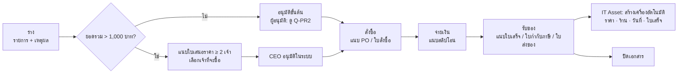

# 08 — Document Workflow (แกนเอกสารกลาง) + เอกสาร IT

สถานะ: **ร่างออกแบบเพื่อตกลงร่วมกัน (2026-09-28)** — ยังไม่ Implement

ทุกกฎในเอกสารนี้มี **ที่มา** กำกับ:

| ป้าย | ความหมาย |
|---|---|
| **[ตัดสินใจ]** | ผู้ใช้ตัดสินใจแล้ว (วันที่ระบุ) |
| **[ผู้ใช้]** | มาจากคำอธิบายงานของผู้ใช้ |
| **[ระบบเดิม]** | พบใน Source code / ข้อมูล / ไฟล์ Excel เดิม (อ้างไฟล์) |
| **[กฎหมาย]** / **[มาตรฐาน]** | อ้างกฎหมายไทยหรือมาตรฐานสากล (ลิงก์ท้ายเอกสาร) |
| **[ข้อเสนอ]** | ผมเสนอด้วยเหตุผลที่เขียนไว้ — **ต้องยืนยัน** และตั้งค่าเปลี่ยนได้โดยไม่แก้โค้ด |

## 0. การตัดสินใจที่ตกลงแล้ว (2026-09-28)

| # | เรื่อง | ตกลง |
|---|---|---|
| D1 | รูปแบบแบบฟอร์ม | **ผสม**: เอกสารทั่วไป Admin สร้างช่องเองได้; เอกสารที่ต้องคำนวณ/ผูกระบบอื่น เขียนโค้ดเฉพาะบนแกนเดียวกัน |
| D2 | การลงนามของ CEO | **กดอนุมัติในระบบ** (ไม่ต้องพิมพ์เซ็น) |
| D3 | ผู้อนุมัติ | กำหนดจาก **ตำแหน่ง** (CEO, หัวหน้าแผนก, หัวหน้าของผู้ขอ) ไม่ผูกตัวคน + ฝากอนุมัติแทนได้ |
| D4 | ลำดับงาน | แกนกลาง + ใบขอซื้อ IT → ตรวจ ISO → ตู้รหัสผ่าน → เอกสารแผนกอื่น |
| D5 | สถาปัตยกรรม | Modular monolith (ระบบเดียวแบ่งโมดูล) ไม่แยก microservice — เหตุผลใน §7 |

## 1. แกนเอกสารกลาง (ใช้ทุกแผนก)

### 1.1 องค์ประกอบ

| องค์ประกอบ | ทำอะไร | ที่มา |
|---|---|---|
| **ประเภทเอกสาร** | ชื่อ, แผนกเจ้าของ, Prefix เลขที่, ช่องข้อมูล (สำหรับเอกสารทั่วไป), ประเภทไฟล์แนบที่ต้องมี | [ตัดสินใจ D1] |
| **เลขที่เอกสาร** | `<PREFIX>-<YYMM>-<ลำดับ 4 หลัก>` เช่น `PR-2609-0001` ออกเลข **ตอนส่ง** (ร่างยังไม่มีเลข) ไม่ใช้ซ้ำ ไม่ข้าม | [ระบบเดิม] `theinventory.orders.report_id` ใช้รูปแบบ ปีเดือน-วัน-ลำดับ (`2609-17-1542`); ออกเลขตอนส่งเพื่อไม่ให้เลขหายจากร่างที่ทิ้ง [ข้อเสนอ] |
| **สถานะกลาง** | ร่าง → ส่งแล้ว/รออนุมัติ → อนุมัติ → ดำเนินการ → เสร็จ · ไม่อนุมัติ · ส่งกลับแก้ · ยกเลิก | [ข้อเสนอ] ครอบคลุมทุกเอกสารที่มีการอนุมัติ; เอกสารเฉพาะเพิ่ม "ขั้นย่อย" ได้ (เช่น สั่งซื้อ/จ่ายเงิน/รับของ) |
| **กฎอนุมัติ** | เงื่อนไข (เช่น ยอดเงิน) → ลำดับขั้นอนุมัติ → ผู้อนุมัติตามตำแหน่ง + ข้อกำหนดเพิ่ม (เช่น ต้องแนบใบเสนอราคา ≥ N ใบ) | [ตัดสินใจ D3], [ผู้ใช้] เกณฑ์ 1,000 บาท |
| **ไฟล์แนบ** | ใช้ระบบไฟล์เดียวกับ IT Asset (ตรวจชนิดจากเนื้อไฟล์, ≤ 20 MB, ไม่ลบ ยกเลิกได้พร้อมเหตุผล) | ทำไว้แล้วใน IT Asset (docs/07) |
| **ความเห็น / ไทม์ไลน์** | ทุกการกระทำเป็นรายการในไทม์ไลน์ของเอกสาร + Audit log | [ข้อเสนอ] ให้ย้อนดูได้ว่าใครทำอะไรเมื่อไร |
| **PDF** | พิมพ์เอกสาร + หน้าบันทึกการอนุมัติ (ชื่อ ตำแหน่ง เวลา รหัสยืนยัน) | [ตัดสินใจ D2] ใช้แทนลายเซ็นกระดาษ |
| **สิทธิ์** | ผู้ขอเห็นของตัวเอง; ผู้อนุมัติเห็นเอกสารที่รอตน; แผนกเจ้าของเห็นทั้งแผนก; Admin ตั้งค่าได้ | [ข้อเสนอ] หลักให้สิทธิ์เท่าที่จำเป็น |

### 1.2 ตำแหน่งและผู้อนุมัติ [ตัดสินใจ D3]

| วิธีระบุผู้อนุมัติ | หาคนจาก | ใช้เมื่อ |
|---|---|---|
| ตำแหน่ง (เช่น CEO) | ผู้ดำรงตำแหน่ง ณ วันที่ส่ง (ตั้งในหน้าตั้งค่า มีวันเริ่ม/สิ้นสุด) | ขั้น CEO |
| หัวหน้าแผนก | หัวหน้าของแผนกเจ้าของเอกสาร | เอกสารที่แผนกต้องรับรอง |
| หัวหน้าของผู้ขอ | หัวหน้าทีม (`org_unit.manager`) ของผู้ขอ | อนุมัติขั้นต้น |
| ระบุคน | คนที่กำหนด | กรณีพิเศษเท่านั้น |

กติกา [ข้อเสนอ — เหตุผล: ควบคุมภายในพื้นฐาน]:
- **ผู้ขออนุมัติเอกสารตัวเองไม่ได้** — ถ้าผู้อนุมัติขั้นใดคือผู้ขอ ข้ามไปขั้นถัดไป (บันทึกว่า "ข้ามเพราะเป็นผู้ขอ"); ถ้าเป็นขั้นสุดท้าย (เช่น CEO ขอซื้อเอง) ส่งให้ผู้ที่ตั้งเป็น "ผู้อนุมัติแทน CEO"
- **ฝากอนุมัติ**: ผู้อนุมัติตั้งผู้รับมอบช่วงวันลาได้ ระบบบันทึกว่า "X อนุมัติแทน Y"
- ผู้อนุมัติ **ถูกกำหนดตอนส่ง** — เปลี่ยนคนดำรงตำแหน่งภายหลังไม่ทำให้เอกสารค้างหาย (เอกสารที่ค้างอยู่ย้ายไปคนใหม่ได้โดย Admin พร้อมบันทึก)

### 1.3 การอนุมัติในระบบ = ลายมือชื่ออิเล็กทรอนิกส์ [ตัดสินใจ D2] [กฎหมาย]

พ.ร.บ.ว่าด้วยธุรกรรมทางอิเล็กทรอนิกส์ พ.ศ. 2544 **มาตรา 9** ยอมรับลายมือชื่ออิเล็กทรอนิกส์เมื่อ (1) ระบุตัวผู้ลงนามได้ และแสดงว่าผู้นั้นรับรองข้อความ และ (2) ใช้วิธีที่เชื่อถือได้ตามสมควร การออกแบบจึงเก็บ:

| ต้องแสดงได้ | ระบบเก็บ |
|---|---|
| ใครลงนาม | ผู้อนุมัติ login ด้วยบัญชี Google Workspace ของบริษัท (มี MFA) — docs/05 |
| ยืนยันตัวตนตอนกด | **ยืนยันตัวตนซ้ำ** กับ Google ก่อนกดอนุมัติเอกสารที่ยอดเกินเกณฑ์ (re-authentication ภายใน N นาที) [ข้อเสนอ] |
| รับรองข้อความใด | **ค่า hash (SHA-256) ของเนื้อหาเอกสาร + ไฟล์แนบ ณ เวลาอนุมัติ** เก็บคู่กับการอนุมัติ; ถ้าเอกสารถูกแก้หลังอนุมัติ ค่า hash ไม่ตรง → การอนุมัตินั้น **เป็นโมฆะอัตโนมัติ** ต้องอนุมัติใหม่ |
| เมื่อไร / จากไหน | เวลา, IP, อุปกรณ์, session — ใน Audit log ที่แก้ไม่ได้ (มีอยู่แล้ว) |
| เจตนา | ข้อความยืนยันบนปุ่ม: "ข้าพเจ้าอนุมัติเอกสาร PR-xxxx ยอด xx บาท" + ช่องความเห็น |

### 1.4 การเก็บรักษา [กฎหมาย]

- เอกสารจัดซื้อ ใบเสร็จ ใบกำกับภาษี สลิปโอน = เอกสารประกอบการลงบัญชี → เก็บ **ไม่น้อยกว่า 5 ปี** นับจากวันปิดบัญชี (พ.ร.บ.การบัญชี พ.ศ. 2543 มาตรา 14; ใบกำกับภาษี: ประมวลรัษฎากร มาตรา 87/3)
- ระบบจึง **ไม่มีการลบเอกสารหรือไฟล์** — มีแต่ "ยกเลิก" พร้อมเหตุผล; นโยบายทำลายหลัง 5–7 ปี รอ Q14 (docs/06)

## 2. ใบขอซื้อ IT (เอกสารตัวแรก) — Purchase Request `PR`

### 2.1 ขั้นตอน

### 2.2 กฎและที่มา

| # | กฎ | ที่มา | ตั้งค่าได้ |
|---|---|---|---|
| PR1 | ยอด **เกิน 1,000 บาท** ต้องเทียบราคาและให้ CEO อนุมัติ | [ผู้ใช้] | ✔ เกณฑ์ |
| PR2 | "เทียบราคากับเจ้าอื่น" = ใบเสนอราคา **อย่างน้อย 2 เจ้า** (เจ้าที่เลือก + เจ้าอื่นอย่างน้อย 1) | [ผู้ใช้] ถ้อยคำ "เปรียบราคากับเจ้าอื่น" → ขั้นต่ำ 2; ถ้าต้องการ 3 เปลี่ยนค่าได้ → **Q-PR1** | ✔ จำนวน |
| PR3 | ใบเสนอราคาทุกใบต้อง **มีไฟล์แนบ** | [ผู้ใช้] "เก็บหลักฐาน" | – |
| PR4 | ถ้าเลือก **ไม่ใช่เจ้าที่ถูกที่สุด** ต้องระบุเหตุผล | [ข้อเสนอ] หลักควบคุมภายใน: ให้ผู้อนุมัติเห็นเหตุผลก่อนเซ็น | – |
| PR5 | ยอดที่ใช้เทียบเกณฑ์ = **ยอดรวมของเจ้าที่เลือก รวม VAT** (ยอดที่บริษัทจ่ายจริง) | [ข้อเสนอ] → **Q-PR3** | ✔ |
| PR6 | ยอด ≤ 1,000 บาท: ผู้อนุมัติ = **หัวหน้าแผนก IT** (ค่าตั้งต้น) | [ข้อเสนอ] ยังไม่ทราบ → **Q-PR2** | ✔ |
| PR7 | จ่ายจริง **เกินยอดที่อนุมัติ** → ต้องอนุมัติใหม่ (ส่วนต่าง) | [ข้อเสนอ] การอนุมัติผูกกับยอดเงิน (§1.3) | ✔ % ที่ยอมให้เกิน (ค่าตั้งต้น 0%) |
| PR8 | **ซอยใบขอซื้อ**: ผู้ขอคนเดียวกัน + ร้านเดียวกัน ภายใน 7 วัน รวมกันเกินเกณฑ์ → ระบบเตือนผู้อนุมัติ (ไม่บล็อก) | [ข้อเสนอ] ป้องกันเลี่ยงเกณฑ์ 1,000 บาท | ✔ จำนวนวัน |
| PR9 | ไฟล์ที่ต้องมีแต่ละขั้น: ใบเสนอราคา (ก่อนส่งอนุมัติ, ถ้า > เกณฑ์) · PO/ใบสั่งซื้อ (ขั้นสั่งซื้อ) · สลิปโอน (ขั้นจ่ายเงิน) · ใบเสร็จ/ใบกำกับภาษี (ขั้นรับของ) | [ผู้ใช้] รายการเอกสาร + [กฎหมาย] ใบกำกับภาษีต้องเก็บ (ม.87/3) | ✔ บังคับ/ไม่บังคับ |
| PR10 | รับของที่เป็นอุปกรณ์ (NB/PC/จอ …) → **สร้างเครื่องใน IT Asset อัตโนมัติ** พร้อมราคา ร้าน วันที่ และลิงก์ใบเสร็จ; ของที่ซื้อมาอัปเกรดเครื่องเดิม (SSD/RAM) → ผูกกับเครื่องนั้น แล้วบันทึกอัปเกรดในประวัติ | [ระบบเดิม] Sheet "อัพเกรด 2026" ผูกรายการซื้อกับรหัสเครื่อง; "ขอซื้อ NB ใหม่" ผูกกับผู้ใช้ | – |
| PR11 | ใบขอซื้อสร้างต่อจาก **คำขอของพนักงาน** ได้ (ขอเปลี่ยนเครื่อง/ขออัปเกรด) — อ้างถึงกัน | [ระบบเดิม] Sheet "ขอซื้อ NB ใหม่" มีคอลัมน์เหตุผลจากผู้ใช้ | – |
| PR12 | ยกเลิกหลังจ่ายเงินแล้ว **ไม่ได้** — ต้องปิดพร้อมบันทึก (คืนเงิน/คืนของ) | [กฎหมาย] เอกสารจ่ายเงินต้องเก็บ (§1.4) | – |

### 2.3 ข้อมูลในใบขอซื้อ

| ส่วน | ช่อง | ที่มา |
|---|---|---|
| หัวเอกสาร | ผู้ขอ, แผนก, เหตุผล/ความจำเป็น, ต้องการภายในวันที่, อ้างอิงคำขอพนักงาน (ถ้ามี) | [ระบบเดิม] Sheet "ขอซื้อ NB ใหม่" (ผู้ใช้ + เหตุผล) |
| รายการ | รายละเอียด, จำนวน, ราคาต่อหน่วยโดยประมาณ, ลิงก์สินค้า, ประเภทอุปกรณ์ (ถ้าเข้า IT Asset), เครื่องที่จะอัปเกรด (ถ้ามี), ใช้สำหรับพนักงาน (ถ้ามี) | [ระบบเดิม] Sheet "อัพเกรด 2026": สิ่งที่ต้องอัพเกรด, ราคา/อัน, LINK WEB, รหัสสินทรัพย์ |
| ใบเสนอราคา | ร้าน, ยอดรวม (รวม VAT), วันหมดอายุราคา, ไฟล์, เลือก/ไม่เลือก, เหตุผลที่เลือก | [ผู้ใช้] + PR3/PR4 |
| การจ่าย | วันที่จ่าย, ยอดจ่ายจริง, วิธี (โอน/เช็ค/เงินสดย่อย), ไฟล์สลิป | [ผู้ใช้] "การโอน" |
| การรับของ | วันที่รับ, ผู้รับ, ไฟล์ใบเสร็จ/ใบกำกับภาษี/ใบส่งของ, รายการที่เข้า IT Asset | [ผู้ใช้] "ใบเสร็จ" + PR10 |

### 2.4 Edge cases

| # | สถานการณ์ | การจัดการ |
|---|---|---|
| E1 | CEO เป็นผู้ขอเอง | ขั้น CEO ส่งให้ "ผู้อนุมัติแทน CEO" (§1.2) |
| E2 | แก้รายการหลัง CEO อนุมัติ | hash ไม่ตรง → การอนุมัติเป็นโมฆะ ต้องส่งอนุมัติใหม่ (§1.3) |
| E3 | ราคาเปลี่ยนตอนสั่งซื้อจริง | PR7: เกินยอดอนุมัติ → อนุมัติส่วนต่าง |
| E4 | ร้านเดียวในตลาด (ไม่มีเจ้าอื่นให้เทียบ) | แนบใบเสนอราคา 1 ใบ + เหตุผล "ผู้ขายรายเดียว" — ผู้อนุมัติเห็นชัดเจน [ข้อเสนอ] |
| E5 | ใบเสนอราคาหมดอายุก่อนอนุมัติ | แสดงคำเตือนแก่ผู้อนุมัติ |
| E6 | ผู้อนุมัติลา | ฝากอนุมัติ (§1.2); เอกสารค้างเกิน N วัน แจ้งเตือนผู้ขอและ Admin |
| E7 | ซื้อ NB แต่ยังไม่ได้ระบุรหัสเครื่อง | ตอนรับของระบบเสนอรหัสถัดไป (`NB-0049`) ตามกฎรหัส docs/07 |
| E8 | ของเสีย/คืนร้าน | บันทึกในไทม์ไลน์ + ไฟล์ใบลดหนี้; เครื่องที่สร้างแล้วเปลี่ยนสถานะ "จำหน่าย/คืนร้าน" |
| E9 | ซอยใบขอซื้อ | PR8 เตือน |

## 3. ใบประวัติการซ่อม — **ทำแล้ว** (IT Asset, docs/07)

เพิ่ม: **PDF ใบประวัติเครื่อง** (สเปก, ผู้ถือครองย้อนหลัง, ซ่อม/อัปเกรดพร้อมค่าใช้จ่าย, ใบขอซื้อที่เกี่ยวข้อง) — [ผู้ใช้] "ใบประวัติการซ่อม"

## 4. ตู้รหัสผ่าน (Credential Vault)

[ผู้ใช้] ต้องเก็บรหัส Map Drive, Xerox, Mail, TRCloud ของพนักงาน; [ระบบเดิม] ปัจจุบันเก็บเป็นข้อความธรรมดาในไฟล์ `พนักงานใหม่_V02032569.xlsx` (docs/07 §1)

| กฎ | ที่มา |
|---|---|
| รหัสผ่านเข้ารหัสด้วยกุญแจใน **Cloud KMS** (ไม่อยู่ในฐานข้อมูล) — ฐานข้อมูลหลุดก็อ่านไม่ได้ | [มาตรฐาน] ISO/IEC 27001:2022 A.8.24 การใช้การเข้ารหัส; [กฎหมาย] PDPA ม.37(1) มาตรการความปลอดภัย |
| ดูรหัส = กด "แสดง" ทีละรายการ + **ยืนยันตัวตนซ้ำ** + บันทึกทุกครั้ง (ใคร/รหัสไหน/เมื่อไร) | [มาตรฐาน] A.8.5 การพิสูจน์ตัวตน, A.8.15 การบันทึก log |
| สิทธิ์เห็น: IT/Admin + เจ้าของบัญชี; บัญชีร่วมของทีม เห็นเฉพาะคนในทีม | [ระบบเดิม] Map Drive เป็นบัญชีรายทีม (team01…); [มาตรฐาน] A.5.15 การควบคุมการเข้าถึง |
| พนักงานออก → เตือนเปลี่ยนรหัสบัญชีร่วมที่คนนั้นเคยเห็น | [มาตรฐาน] A.5.11 การคืนทรัพย์สิน / A.5.18 สิทธิ์การเข้าถึง |
| **ไม่มี auto-login** ไปเว็บอื่น (browser ไม่อนุญาต) — copy ไปวาง | ตรวจแล้วรอบก่อน |
| ย้ายรหัสจาก Excel → ตู้ แล้ว **เปลี่ยนรหัสทั้งหมด 1 รอบ** และลบคอลัมน์รหัสในไฟล์เดิม | [ข้อเสนอ] รหัสที่เคยอยู่ในไฟล์ถือว่ารั่วแล้ว |

เงื่อนไขก่อนสร้าง: ย้ายไป Google Workspace (ยืนยันตัวตนซ้ำ) + มี Cloud KMS — [ตัดสินใจ D4]

## 5. ตรวจมาตรฐาน ISO รายเครื่อง

[ผู้ใช้] "บันทึกตรวจสอบ ISO สำหรับ Notebook แต่ละเครื่องให้ผ่านมาตรฐาน"

- **แบบฟอร์มตรวจ (template)** แก้ข้อได้ มีเวอร์ชัน — ผลตรวจอ้างเวอร์ชันที่ใช้ตอนตรวจ
- **รอบตรวจ** (เช่น รายเดือน/รายไตรมาส) → รายการเครื่องที่ต้องตรวจ → ผลรายข้อ ผ่าน / ไม่ผ่าน / ไม่เกี่ยวข้อง + รูปหลักฐาน
- ข้อที่ **ไม่ผ่าน → เปิดงานแก้ไขอัตโนมัติ** (คำขอ IT) และตรวจซ้ำ
- หน้าเครื่องแสดงป้าย "ผ่าน ISO รอบล่าสุด / ไม่ผ่าน / ยังไม่ตรวจ"
- [ระบบเดิม] รอบสำรวจรายเดือนในไฟล์ Excel (แท็บ MM.69) = ต้นแบบของ "รอบตรวจ"; คอลัมน์ "หมายเหตุจาก IT", "ประสิทธิภาพ" ย้ายมาเป็นข้อตรวจ

**ข้อตรวจตั้งต้น** (แก้ได้ — ต้องยืนยันกับผู้ดูแลระบบ ISO ของบริษัท → **Q-ISO1**):

| ข้อ | ตรวจอะไร | อ้างอิง ISO/IEC 27001:2022 Annex A |
|---|---|---|
| 1 | เครื่องอยู่ในทะเบียน มีป้ายรหัส ผู้ถือตรงกับระบบ | 5.9 Inventory of assets |
| 2 | ติดตั้งแอนตี้ไวรัส (ESET) ไลเซนส์ยังไม่หมด และอัปเดตแล้ว | 8.7 Protection against malware |
| 3 | Windows / โปรแกรมหลักอัปเดตแพตช์ความปลอดภัยแล้ว | 8.8 Management of technical vulnerabilities |
| 4 | เปิดการเข้ารหัสดิสก์ (BitLocker) | 8.1 User endpoint devices, 8.24 Use of cryptography |
| 5 | ล็อกหน้าจออัตโนมัติ + มีรหัสผ่านเข้าเครื่อง | 8.1, 8.5 Secure authentication |
| 6 | ผู้ใช้ไม่มีสิทธิ์ Admin เครื่อง / ไม่มีโปรแกรมเถื่อน | 8.2 Privileged access rights, 8.19 Installation of software |
| 7 | สำรองข้อมูลงานตามนโยบาย (Drive / Map Drive) | 8.13 Information backup |
| 8 | สภาพเครื่อง/อายุ/ประสิทธิภาพ (จาก Sheet เดิม) | 7.13 Equipment maintenance |

## 6. เอกสารของแผนกอื่น (อีก 3 แผนก)

ยังไม่มีข้อมูล — ขอให้แต่ละแผนกกรอก (ช่องเดียวกับที่ใช้ออกแบบ IT):

| แผนก | ชื่อเอกสาร | ใครเขียน | ใครอนุมัติ (กี่ขั้น) | เงื่อนไขพิเศษ | ไฟล์ที่ต้องแนบ | ตอนนี้ใช้อะไร |
|---|---|---|---|---|---|---|

แกนกลาง (§1) ออกแบบให้เอกสารทั่วไปของแผนกเหล่านี้ **ตั้งค่าได้โดยไม่แก้โค้ด**; เอกสารที่ต้องผูกระบบอื่นจะประเมินเป็นรายตัว

## 7. สถาปัตยกรรม [ตัดสินใจ D5]

| เหตุผลที่ไม่แยก microservice | |
|---|---|
| ข้อมูลโยงกันแน่น | ใบขอซื้อ ↔ เครื่อง ↔ ร้าน ↔ พนักงาน ↔ ไฟล์ ↔ การอนุมัติ ต้องบันทึกพร้อมกัน (transaction เดียว) |
| ขนาดองค์กร | ~60 ผู้ใช้, ทีมพัฒนาเล็ก — microservice เพิ่มค่าดูแลหลายเท่าโดยไม่ได้ประโยชน์ |
| แยกทีหลังได้ | โค้ดแบ่งโมดูลชัด (`documents`, `purchase`, `assets`, `vault`, `inspection`) |

ส่วนที่แยกจริง: ไฟล์ → Cloud Storage; กุญแจตู้รหัส → Cloud KMS; งานเบื้องหลัง (แจ้งเตือน, ปิดสถานะพนักงานตามวันสิ้นสุด) → process แยกจากโค้ดชุดเดียวกัน

## 8. ลำดับการสร้าง [ตัดสินใจ D4]

| Phase | ขอบเขต | ขึ้นกับ |
|---|---|---|
| A | แกนเอกสาร: ประเภทเอกสาร, เลขที่, สถานะ, ตำแหน่ง/ผู้อนุมัติ/ฝากอนุมัติ, กฎอนุมัติ, ไฟล์, ไทม์ไลน์, PDF, หน้า "รออนุมัติ" | – |
| B | ใบขอซื้อ IT บนแกน + เชื่อม IT Asset + คำขอพนักงาน | A |
| C | ตรวจ ISO รายเครื่อง | IT Asset |
| D | ตู้รหัสผ่าน | Google Workspace + Cloud KMS |
| E | เอกสารแผนกอื่น | A + ข้อมูลจาก §6 |

## 9. คำถามที่ต้องตอบ (ระหว่างนี้ใช้ค่าตั้งต้นที่ระบุ — แก้ได้ในหน้าตั้งค่า)

| # | คำถาม | ค่าตั้งต้น |
|---|---|---|
| Q-PR1 | ใบเสนอราคาขั้นต่ำกี่เจ้า (เกิน 1,000 บาท) | 2 |
| Q-PR2 | ยอด ≤ 1,000 บาท ใครอนุมัติ | หัวหน้าแผนก IT |
| Q-PR3 | เกณฑ์ 1,000 บาท รวม VAT หรือไม่ | รวม VAT (ยอดจ่ายจริง) |
| Q-PR4 | ใครดำรงตำแหน่ง CEO / ใครอนุมัติแทน CEO | Admin ตั้งในหน้าตั้งค่า |
| Q-PR5 | หลังจ่ายเงิน ต้องส่งข้อมูลเข้า TRCloud หรือไม่ | ไม่ส่ง (ฝ่ายบัญชีบันทึกเอง) |
| Q-ISO1 | ใช้ ISO ฉบับใด มี checklist เดิมหรือไม่ | ISO/IEC 27001:2022 — 8 ข้อใน §5 |
| Q-DOC1 | เอกสารของอีก 3 แผนก | รอตาราง §6 |

## 10. รับ–ส่งเอกสาร (DELIPAS) — **รวมเข้าพอร์ทัลแล้ว** (2026-10-01)

ยืนยันแล้ว: เป็นเมนูในพอร์ทัล และ **ใช้บอร์ด monday ต่อ** (monday เป็นแหล่งข้อมูลหลัก — สร้าง/มอบหมายงานใน monday เหมือนเดิม)

| | DELIPAS เดิม | ในพอร์ทัล |
|---|---|---|
| เข้าใช้ | แอปแยก มีระบบล็อกอินของตัวเอง | เมนู **รับ–ส่งเอกสาร** (`/handoff`) ใช้ session พอร์ทัล + สิทธิ์ `handoff.use` (ให้ EMPLOYEE ทุกคน) |
| รายการ | 4 ตาราง (วันนี้ / New request / รอดำเนินการ / เสร็จ2569) ล่าสุด 30 รายการ | เหมือนเดิม — ดึงทุกแท็บในคำขอเดียว, cache 30 วินาที, ปุ่มโหลดใหม่ |
| บันทึก | อัปโหลดลายเซ็น → ตั้งสถานะ/ชื่อผู้เซ็น/เวลา | เหมือนเดิม + ตรวจว่าบอร์ดยังมีคอลัมน์/ชื่อสถานะเดิม, ปฏิเสธถ้ารายการถูกแก้ใน monday หลังเปิด, ส่งซ้ำด้วย `requestId` เดิมไม่บันทึกซ้ำ, ฉบับร่างเก็บในเครื่อง |
| ลิงก์ให้ผู้เซ็น | ใช้ token บันทึกเป็นลิงก์ | ลิงก์ชนิด `share` แยกต่างหาก (HMAC, 1 ชั่วโมง, เฉพาะรายการนั้น) + QR → หน้า `/sign` ไม่ต้องล็อกอิน, จำกัดต่อ IP, บันทึก audit `handoff.share_link` / `handoff.save_via_link` (รู้ว่าใครสร้างลิงก์) |
| Token monday | `.env.local` ของ DELIPAS | คัดลอกเข้า `.env` ของ pas-platform (ไม่ commit) — ทดสอบอัตโนมัติใช้ monday ปลอมเสมอ |

**คำถาม** (ระหว่างนี้ใช้ค่าตั้งต้น):

| # | คำถาม | ค่าตั้งต้น |
|---|---|---|
| Q-HO1 | บอร์ด `5031213491` (DELIPAS แสดงว่า “Duplicate … -DEV”) คือบอร์ดจริงที่ใช้งาน หรือบอร์ดทดสอบ? ถ้าเป็นบอร์ดทดสอบ บอร์ดจริงคือเลขอะไร | ใช้ `5031213491` (ตั้งใน `MONDAY_HANDOFF_BOARD_ID`) |
| Q-HO2 | ใครควรใช้เมนูนี้ได้ (ตอนนี้พนักงานทุกคน) | EMPLOYEE ทุกคน |
| Q-HO3 | ลิงก์ให้ผู้เซ็นอายุ 1 ชั่วโมงพอหรือไม่ | 1 ชั่วโมง (เท่า DELIPAS) |
| Q-HO4 | ปิดแอป DELIPAS เดิมเมื่อพอร์ทัลขึ้นจริงหรือไม่ | ปิด หลังใช้คู่กัน 2 สัปดาห์ |
| Q-HO5 | token monday เป็นของบัญชีส่วนตัว — ควรเปลี่ยนเป็นบัญชีระบบ (service account) และหมุน token ใหม่หรือไม่ | แนะนำให้เปลี่ยน |

## แหล่งอ้างอิง

- พ.ร.บ.ว่าด้วยธุรกรรมทางอิเล็กทรอนิกส์ พ.ศ. 2544 (มาตรา 9, 26) — [สพธอ. (ETDA)](https://www.etda.or.th/th/Useful-Resource/%E0%B8%81%E0%B8%8F%E0%B8%AB%E0%B8%A1%E0%B8%B2%E0%B8%A2-HTML/%E0%B8%9E%E0%B8%A3%E0%B8%B0%E0%B8%A3%E0%B8%B2%E0%B8%8A%E0%B8%9A%E0%B8%8D%E0%B8%8D%E0%B8%95%E0%B8%A7%E0%B8%B2%E0%B8%94%E0%B8%A7%E0%B8%A2%E0%B8%98%E0%B8%A3%E0%B8%81%E0%B8%A3%E0%B8%A3%E0%B8%A1%E0%B8%97%E0%B8%B2%E0%B8%87%E0%B8%AD%E0%B9%80%E0%B8%A5%E0%B8%81%E0%B8%97%E0%B8%A3%E0%B8%AD%E0%B8%99%E0%B8%81%E0%B8%AA-%E0%B8%9E-%E0%B8%A8-2544.aspx), [zDOX สรุปมาตรา 9, 26, 28](https://www.zdox.net/electronic-transactions-act_09_26_28/)
- พ.ร.บ.การบัญชี พ.ศ. 2543 มาตรา 14 — [กรมส่งเสริมอุตสาหกรรม (PDF)](https://www.dip.go.th/uploadcontent/boom_LAW/GNB_022.pdf); ระยะเก็บเอกสารบัญชี/ใบกำกับภาษี (ม.87/3) — [หอการค้าไทย](https://www.thaichamber.org/news/view/87/2974/smart-to-know), [getInvoice](https://www.getinvoice.net/preserve_document/)
- ISO/IEC 27001:2022 Annex A 8.1 User endpoint devices — [ISMS.online](https://www.isms.online/iso-27001/annex-a-2022/8-1-user-endpoint-devices-2022/), [HighTable audit checklist](https://hightable.io/iso-27001-annex-a-8-1-audit-checklist/)
